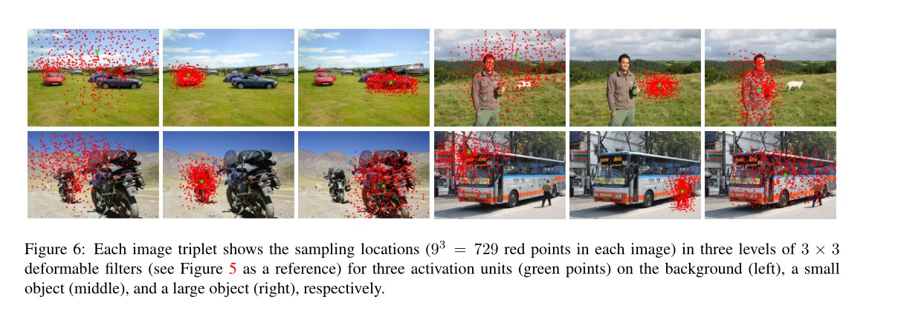

# DCN论文

## 0.未解决问题

2.2.3 得到可变形池化核的时候，为什么x2？

**一个如何画图的问题**？

图上的散点怎么打出来？这个结果应该只用到了网络的一部分。

## 1.introduction

### 1.1 deformable convolution

规则采样，变形采样，变形采样的特殊情况实现缩放和旋转

### 1.2 deformable roi pooling

可变形卷积网络

## 2.DCN

### 2.1 deformable convolution

#### 2.1.1过程

#### 2.1.2计算

##### 感受野

$$
\mathcal{R}=\{(-1,-1),(-1,0), \ldots,(0,1),(1,1)\}
$$

$$
\mathbf{y}\left(\mathbf{p}_{0}\right)=\sum_{\mathbf{p}_{n} \in \mathcal{R}} \mathbf{w}\left(\mathbf{p}_{n}\right) \cdot \mathbf{x}\left(\mathbf{p}_{0}+\mathbf{p}_{n}\right)
$$

##### 加入可变形

$$
\mathbf{y}\left(\mathbf{p}_{0}\right)=\sum_{\mathbf{p}_{n} \in \mathcal{R}} \mathbf{w}\left(\mathbf{p}_{n}\right) \cdot \mathbf{x}\left(\mathbf{p}_{0}+\mathbf{p}_{n}+\Delta \mathbf{p}_{n}\right)
$$

##### x值小数，计算方法

$$
\mathbf{x}(\mathbf{p})=\sum_{\mathbf{q}} G(\mathbf{q}, \mathbf{p}) \cdot \mathbf{x}(\mathbf{q})
$$

##### 双线性差值核

$$
G(\mathbf{q}, \mathbf{p})=g\left(q_{x}, p_{x}\right) \cdot g\left(q_{y}, p_{y}\right)
$$

$$
g(a, b)=\max (0,1-|a-b|)
$$

### 2.2 deformable roi pooling

#### 2.2.1 池化过程

#### 2.2.2 公式

$$
\mathbf{y}(i, j)=\sum_{\mathbf{p} \in b i n(i, j)} \mathbf{x}\left(\mathbf{p}_{0}+\mathbf{p}\right) / n_{i j}
$$

变形后
$$
\mathbf{y}(i, j)=\sum_{\mathbf{p} \in b i n(i, j)} \mathbf{x}\left(\mathbf{p}_{0}+\mathbf{p}+\Delta \mathbf{p}_{i j}\right) / n_{i j}
$$

#### 2.2.3 位置敏感池化

### 2.3 deformable ConvNets

和标准卷积的比较

## 3.与之前工作的差异

是atrous convolution的推广