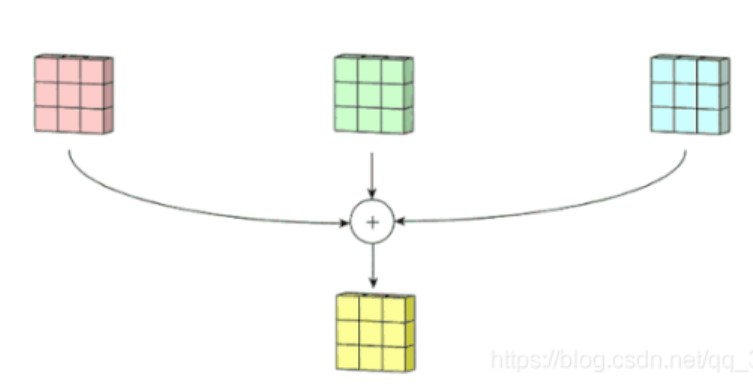
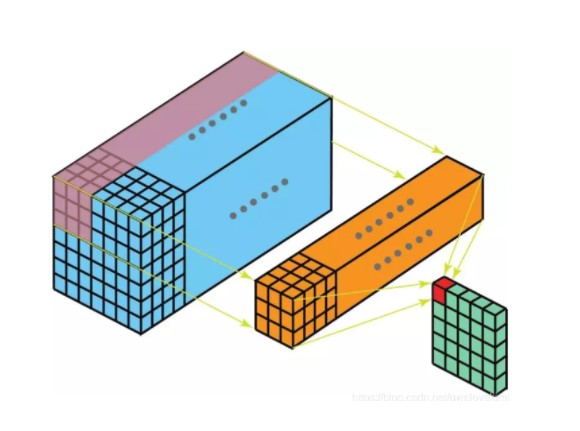
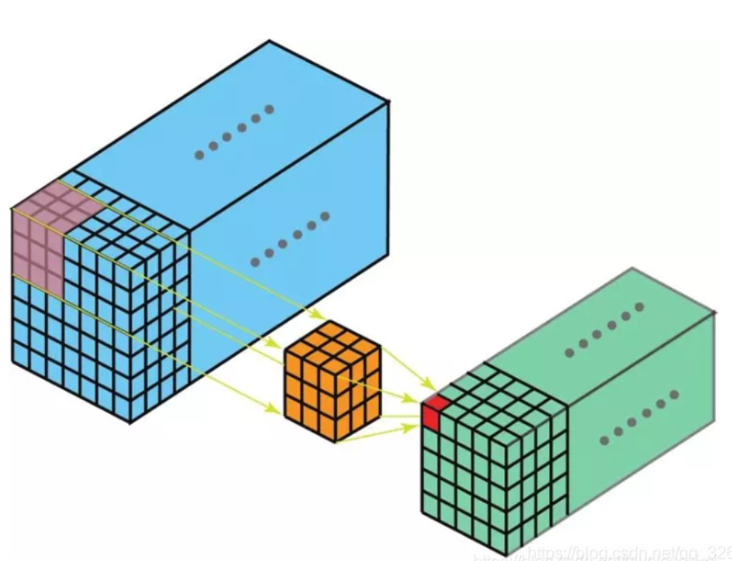
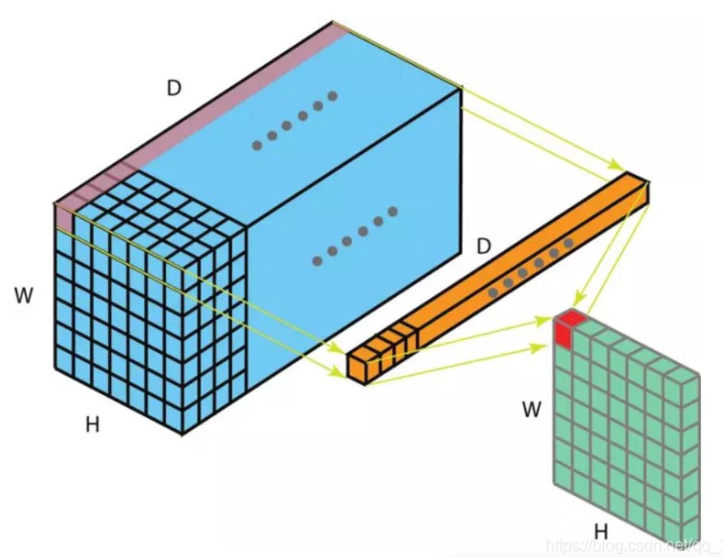
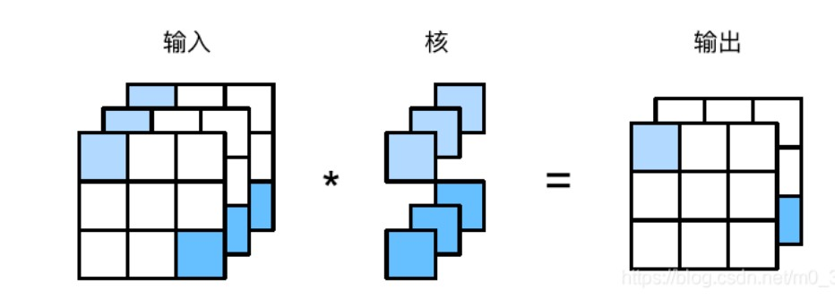
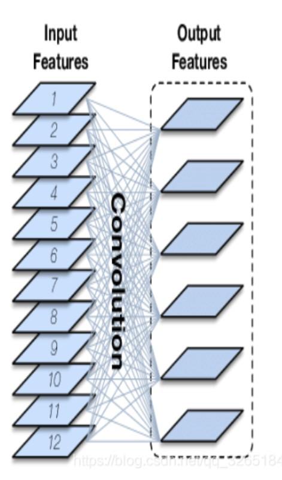
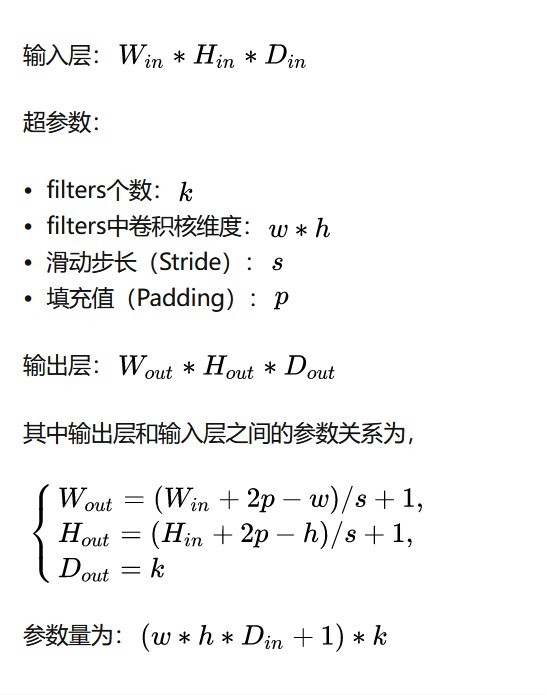

一些学习链接

[2021-06-23 各种经典卷积神经网络总结_m0_47180208的博客-CSDN博客_2021卷积神经网络](https://blog.csdn.net/m0_47180208/article/details/118154762?ops_request_misc=%7B%22request%5Fid%22%3A%22164310298116780366525063%22%2C%22scm%22%3A%2220140713.130102334.pc%5Fall.%22%7D&request_id=164310298116780366525063&biz_id=0&utm_medium=distribute.pc_search_result.none-task-blog-2~all~first_rank_ecpm_v1~rank_v31_ecpm-29-118154762.pc_search_result_cache&utm_term=卷积总结&spm=1018.2226.3001.4187)

[总结 | 一文读懂深度学习中的各种卷积_王博（Kings）的博客-CSDN博客](https://blog.csdn.net/qq_15698613/article/details/116751268?ops_request_misc=%7B%22request%5Fid%22%3A%22164310287416780274166382%22%2C%22scm%22%3A%2220140713.130102334.pc%5Fall.%22%7D&request_id=164310287416780274166382&biz_id=0&utm_medium=distribute.pc_search_result.none-task-blog-2~all~first_rank_ecpm_v1~rank_v31_ecpm-5-116751268.pc_search_result_cache&utm_term=卷积总结&spm=1018.2226.3001.4187)

[深度学习中的各种卷积总结_PRIS-SCMonkey的博客-CSDN博客_各种卷积](https://blog.csdn.net/weixin_43624538/article/details/96917113?ops_request_misc=%7B%22request%5Fid%22%3A%22164310287416780274166382%22%2C%22scm%22%3A%2220140713.130102334.pc%5Fall.%22%7D&request_id=164310287416780274166382&biz_id=0&utm_medium=distribute.pc_search_result.none-task-blog-2~all~first_rank_ecpm_v1~rank_v31_ecpm-1-96917113.pc_search_result_cache&utm_term=卷积总结&spm=1018.2226.3001.4187)

# 经典卷积神经网络

## 1.原始卷积vanilla convolution

### 1.1 二维卷积

#### 1.1.1多输入通道

二维多通道卷积，处理3维的数据，但仍是二维卷积，这个三维过滤器仅沿着图像的宽和高移动。

每个通道结果会通过元素级加法相加。

5x5x3的矩阵使用3x3x3卷积核卷积后得到结果。

#### 1.1.2 多输出通道

输入通道是C，输出通道是D，图像高H宽W，则卷积核形状为
$$
C \times D \times H \times W
$$
为每个输出通道都建立相同的卷积核，并在通道维度联结。

### 1.2 三维卷积

过滤器深度比输入层深度更小，卷积核大小<通道大小。卷积核沿着高、宽及图像通道三个方向移动。每个位置经过元素级别乘法得到一个值，最后的结果是三维的。

### 1.3 1x1卷积

可经历激活层进行非线性映射，改变了特征图的通道数目。

- 增强特征表达能力
  1×1卷积本质上也是一个带参数的滤波器，在不改变特征图本身尺寸的情况下，能够增加网络深度。通过在卷积后通过非线性激活函数可以有效的增强网络的表达能力。
- 升维和降维
  1×1卷积可以通过增加或减少滤波器的数量来实现升维或降维的目的。与全连接层不同，由于卷积是基于权值共享，因此能够有效的降低网络的参数量和计算量。另一方面，降低维度可以认为是通过减少冗余的特征图来降低模型中间层权重的稀疏性，从而得到一个更加紧凑的网络结构。
- 跨通道的信息交互
  类似于多层感知机，1×1卷积本质上就是多个特征图之间的线性组合。因此，通过1×1卷积操作可以轻松实现跨通道的信息交互和整合。

### 1.4 特殊的原始卷积

### 1.5 关于参数

输入CHW，卷积核D个，输出通道与卷积核的数量一致为D，每个卷积核尺寸为CKK，N个卷积核的总参数有NCKK个，输入与输出的连接方式如下。

**二维卷积的参数**

# 