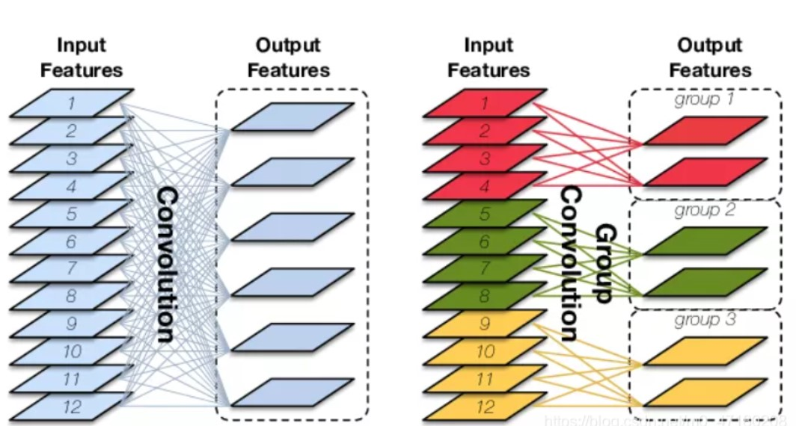
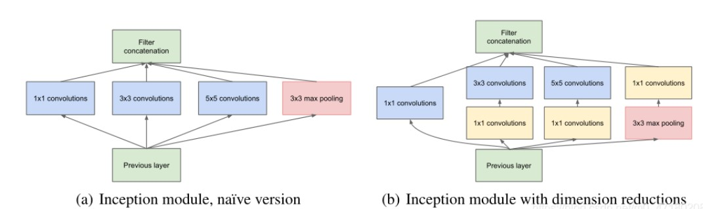

# 经典卷积神经网络

## 1.原始卷积vanilla convolution

### 1.1 二维卷积

#### 1.1.1多输入通道

二维多通道卷积，处理3维的数据，但仍是二维卷积，这个三维过滤器仅沿着图像的宽和高移动。

每个通道结果会通过元素级加法相加。

5x5x3的矩阵使用3x3x3卷积核卷积后得到结果。

#### 1.1.2 多输出通道

输入通道是C，输出通道是D，图像高H宽W，则卷积核形状为
$$
C \times D \times H \times W
$$
为每个输出通道都建立相同的卷积核，并在通道维度联结。

### 1.2 三维卷积

过滤器深度比输入层深度更小，卷积核大小<通道大小。卷积核沿着高、宽及图像通道三个方向移动。每个位置经过元素级别乘法得到一个值，最后的结果是三维的。

### 1.3 1x1卷积

可经历激活层进行非线性映射，改变了特征图的通道数目。

- 增强特征表达能力
  1×1卷积本质上也是一个带参数的滤波器，在不改变特征图本身尺寸的情况下，能够增加网络深度。通过在卷积后通过非线性激活函数可以有效的增强网络的表达能力。
- 升维和降维
  1×1卷积可以通过增加或减少滤波器的数量来实现升维或降维的目的。与全连接层不同，由于卷积是基于权值共享，因此能够有效的降低网络的参数量和计算量。另一方面，降低维度可以认为是通过减少冗余的特征图来降低模型中间层权重的稀疏性，从而得到一个更加紧凑的网络结构。
- 跨通道的信息交互
  类似于多层感知机，1×1卷积本质上就是多个特征图之间的线性组合。因此，通过1×1卷积操作可以轻松实现跨通道的信息交互和整合。

### 1.4 特殊的原始卷积

### 1.5 关于参数

输入CHW，卷积核D个，输出通道与卷积核的数量一致为D，每个卷积核尺寸为CKK，N个卷积核的总参数有NCKK个，输入与输出的连接方式如下。

**二维卷积的参数**

## 2. 分组卷积Group convolution

### 2.1 组卷积介绍

#### 2.1.1 介绍

最早应用于AlexNet。

#### 2.1.2 分组卷积的作用

1.减少参数量

2.可以堪称structured sparse，也即是对于普通卷积而言，将普通卷积的部分参数当作0，有时能够取得更好的效果（相当于正则，见附1）。

3.当分组数量等于输入通道数等于输出通道数时，分组卷积成为深度卷积，参数数量进一步缩减。

4.分组数量等于输入通道数等于输出通道数，且卷积核尺寸与输入map尺寸相同，则成为全局深度卷积（Global Depthwise Convolution, GDC)，见MobileFaceNet，可以当作全局加权池化。相对于全局平均池化而言，GDC给每个未知赋予可学习的权利（比如用于人脸图像）。

以上内容参考链接[分组卷积_jacke121的专栏-CSDN博客_分组卷积](https://blog.csdn.net/jacke121/article/details/114274586?ops_request_misc=%7B%22request%5Fid%22%3A%22164354213716780357291098%22%2C%22scm%22%3A%2220140713.130102334.pc%5Fall.%22%7D&request_id=164354213716780357291098&biz_id=0&utm_medium=distribute.pc_search_result.none-task-blog-2~all~first_rank_ecpm_v1~rank_v31_ecpm-1-114274586.pc_search_result_cache&utm_term=分组卷积&spm=1018.2226.3001.4187)

#### 2.1.3 分组卷积的参数

输入特征图尺寸为$C*H *W$，输出通道数为$N$，分成$G$个组，则每个组的输入特征图为$C/G$个，每个组的输出特征图为$N/G$个，每个卷积核尺寸为$\frac{C}{G}*K*K$，卷积核个数仍然是$N$个，每组卷积核数量为$N/G$，总的卷积核参数数量为$N*\frac{C}{G}*K*K$。

### 2.2 逐点分组卷积resnext

#### 2.2.1 逐点卷积

由于一个特征图仅被一个滤波器卷积，无法有效的利用不同通道在相同空间位置上的特征信息，由此加入了逐点卷积。点卷积主要是要1×1卷积构成，负责将深度卷积的输出按通道投影到一个新的特征图上。

#### 2.2.2 逐点分组

### 2.3 混洗分组卷积shuffle net

结合了逐点组卷积(Pointwise Group Convolution, PGC)和通道混洗(channel shuffle)，来实现一个高效轻量化的移动端网络设计。

## 3. 转置卷积/反卷积transposed convolution

与常规的卷积操作不同，转置卷积是一种一对多的映射关系，即输入矩阵中的一个值映射到输出矩阵的K×K(kernel size)个值。在具体的实现当中，需要维护一个转置矩阵，这个矩阵参数是可学习的。

## 4. 空洞卷积atrous convolution

空洞卷积（dilated convolution）是针对图像语义分割问题中下采样会降低图像分辨率、丢失信息而提出的一种卷积思路。扩张卷积（dilated convolutions）又名空洞卷积（atrous convolutions）。

利用添加空洞扩大感受野，让原本3x3的卷积核，在相同参数量和计算量下拥有5x5（dilated rate =2）或者更大的感受野，从而无需下采样。空洞卷积向卷积层引入了一个称为 “扩张率(dilation rate)”的新参数，该参数定义了卷积核处理数据时各值的间距。相比原来的标准卷积，空洞卷积多了一个hyper-parameter（超参数）称之为dilation rate（扩张率），指的是kernel各点之前的间隔数量，（正常的convolution 的 dilatation rate为 1）。

在相同的计算条件下，空洞卷积提供了更大的感受野。空洞卷积经常用在实时图像分割中。当网络层需要较大的感受野，但计算资源有限而无法提高卷积核数量或大小时，可以考虑空洞卷积。

### 4.1特征

- 增大感受野
  空洞卷积可以在同等卷积核参数下获得更大的感受野。所以，对于需要较为全局的语义信息或类似于语音文本需要较长的序列信息依赖的任务中，都可以尝试应用空洞卷积。
- 表征多尺度信息
  利用带有不同空洞率的卷积，还可以捕捉到多尺度的上下文语义信息。不同的空洞率代表着不同的感受野，意味着网络能够感知到不同尺寸的目标。

### 4.2操作

## 5. 可分离卷积separable convolution

### 5.0 深度卷积depthwise convolution

不同于原始卷积，深度卷积是一个卷积核负责一个通道，独立地在每个通道上进行空间卷积。因此，深度卷积的输出特征图数量等于输入特征图数量，无法进行有效的维度扩展。

### 5.1 深度可分离卷积depthwise separable convolution

深度可分卷积可大幅度减少卷积的参数。因此对于规模较小的模型，如果将2D卷积替换为深度可分卷积，其模型大小可能会显著降低，模型的能力可能会变得不太理想，因此得到的模型可能是次优的。但如果使用得当，深度可分卷积能在不牺牲模型性能的前提下显著提高效率。

#### 5.1.1特征

- 降低参数量和计算量
  深度可分离卷积将原始的卷积运算分为两层，一层用于滤波（深度卷积），一层用于组合（逐点卷积）。这种分解过程能极大减少模型的参数量和计算量。
- 降低模型容量
  深度可分离卷积在应用时并没有使用激活函数。此外，虽然深度可分离卷积可以显著的降低模型的计算量，但同时也会导致模型的容量显著降低，从而导致模型精度的下降。

### 5.2 空间可分离卷积spacewise separable convolution

虽然空间可分卷积可节省成本，但很少用于深度学习。其中一个主要的原因是：**并非所有卷积核都可以分成两个较小的卷积核。如果我们用空间可分卷积取代所有传统的卷积，则有可能我们限制自己在训练期间搜索所有可能的内核，导致模型训练结果不尽如人意。**

## 6. 植入块 inception block

Inception Block最初提出的目的是希望能够在同一层特征图上获得不同尺度下的特征表征，增加网络宽度有利于获得更丰富的特征表示。

提高网络最简单粗暴的方法就是提高网络的深度和宽度，即增加隐层和以及各层神经元数目。但这种简单粗暴的方法存在一些问题：

- 会导致更大的参数空间，更容易过拟合 需要更多的计算资源 网络越深，梯度容易消失，优化困难（这时还没有提出BN时，网络的优化极其困难）

下图第一个结构，有四个通道，有$1*1$、$3*3$、$5*5$卷积核，该结构有几个特点：

使用这些大小卷积核，没有什么特殊含义，主要方便对齐，只要padding = 0、1、2，就可以得到相同大小的特征图，可以顺利concat。采用大小不同的卷积核，意味着感受野的大小不同，就可以得到不同尺度的特征。采用比较大的卷积核即5*5，因为有些相关性可能隔的比较远，用大的卷积核才能学到此特征。大量的引入了1×1卷积，从而减小网络的整体规模。
**优势**：特征在不同尺度上进行处理聚合，这样下一步可以从不同尺度提取特征

**google net 详细内容见202106笔记**

Going Deeper with Convolutions
为了进一步地压缩网络的参数量和计算量，作者在原先的Inception块中大量的引入了1×1卷积，从而减小网络的整体规模。

Batch Normalization Accelerating Deep Network Training by Reducing Internal Covariate Shift
Inception v2的主要思想便是提出了Batch Normalization，通过减少内部协变量偏移有效的加速了深度网络的训练。此外，借鉴VGG-Net的思想，v2将v1中的5×5卷积用两个3×3卷积进行替换，在保证获得同等感受野的情况下，进一步的降低网络的参数量和计算量。

## 7. 可变形卷积 deformable convolution

**详见dcn日志内容**

## 8. 扁平卷积 flattened convolution

# 近期改进

# 注：

## 1.正则

选择模型的一种方法，旨在减小泛化误差而不是训练误差。

常见的正则化方法包括：

1.参数范数惩罚，如L1正则化或L2正则化；

2.噪声注入，如数据集增强或dropout方法；

3.多任务学习；

4.提前终止；

5.稀疏表示

等等。具体可参考https://blog.csdn.net/qq_16137569/article/details/81584165

