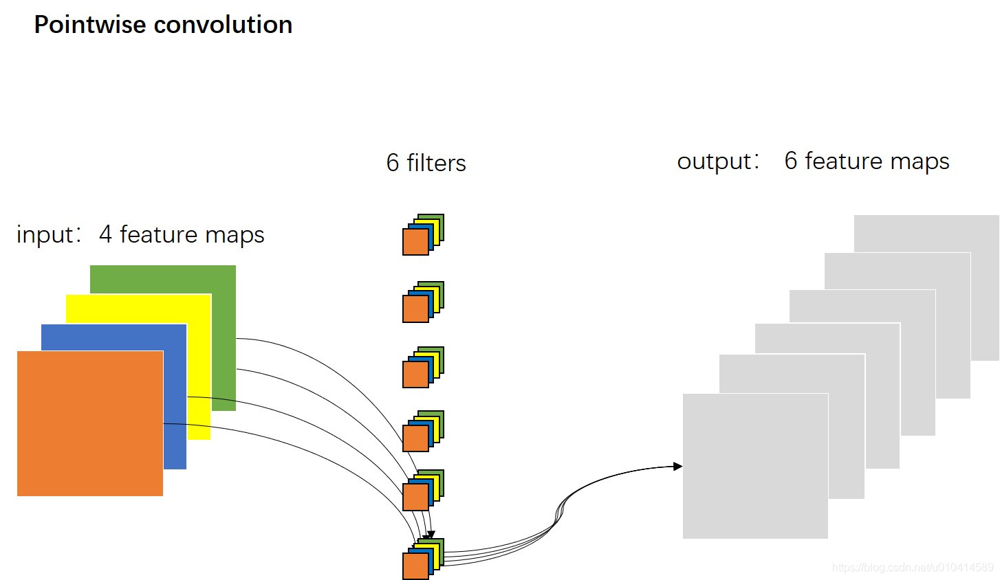
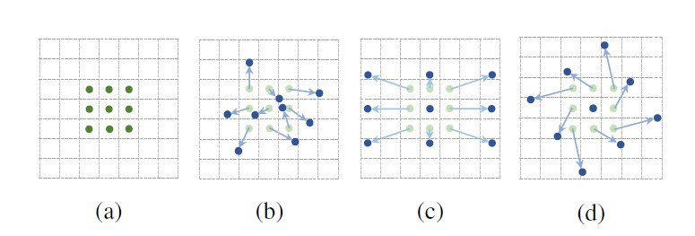

# 各类卷积小结

[TOC]

# 经典卷积神经网络

## 1.原始卷积vanilla convolution

### 1.1 二维卷积

#### 1.1.1多输入通道

二维多通道卷积，处理3维的数据，但仍是二维卷积，这个三维过滤器仅沿着图像的宽和高移动。

每个通道结果会通过元素级加法相加。

5x5x3的矩阵使用3x3x3卷积核卷积后得到结果。

#### 1.1.2 多输出通道

输入通道是C，输出通道是D，图像高H宽W，则卷积核形状为
$$
C \times D \times H \times W
$$
为每个输出通道都建立相同的卷积核，并在通道维度联结。

### 1.2 三维卷积

过滤器深度比输入层深度更小，卷积核大小<通道大小。卷积核沿着高、宽及图像通道三个方向移动。每个位置经过元素级别乘法得到一个值，最后的结果是三维的。

### 1.3 1x1卷积pointwise

可经历激活层进行非线性映射，改变了特征图的通道数目。

- 增强特征表达能力
  1×1卷积本质上也是一个带参数的滤波器，在不改变特征图本身尺寸的情况下，能够增加网络深度。通过在卷积后通过非线性激活函数可以有效的增强网络的表达能力。
- 升维和降维
  1×1卷积可以通过增加或减少滤波器的数量来实现升维或降维的目的。与全连接层不同，由于卷积是基于权值共享，因此能够有效的降低网络的参数量和计算量。另一方面，降低维度可以认为是通过减少冗余的特征图来降低模型中间层权重的稀疏性，从而得到一个更加紧凑的网络结构。
- 跨通道的信息交互
  类似于多层感知机，1×1卷积本质上就是多个特征图之间的线性组合。因此，通过1×1卷积操作可以轻松实现跨通道的信息交互和整合。

### 1.4 特殊的原始卷积

### 1.5 关于参数

输入CHW，卷积核D个，输出通道与卷积核的数量一致为D，每个卷积核尺寸为CKK，N个卷积核的总参数有NCKK个，输入与输出的连接方式如下。

**二维卷积的参数**

## 2. 分组卷积Group convolution

### 2.1 组卷积介绍

#### 2.1.1 介绍

最早应用于AlexNet。

AlexNet中，实现它的主要原因是——要使用两个内存有限的GPU（每个GPU 1.5GB内存）进行网络培训。下面的Alexnet在大多数层显示了两个独立的卷积路径。它在两个GPU之间执行模型并行化（当然，如果有更多的GPU可用，可以执行多个GPU并行化），AlexNet结构图如下。

##### 工作原理

标准二维卷积

在分组卷积中，滤波器被分成不同的组。每组负责具有一定深度的传统二维卷积。

#### 2.1.2 分组卷积的作用

1.减少参数量，模型更加高效，例如，当过滤器组数增加时，模型参数就会减少。在前一个案例中，在标准的 2D 卷积中，过滤器有 h x w x Din x Dout 个参数，而在拆分为 2 个过滤器组的分组卷积中，过滤器仅有 (h x w x Din/2 x Dout/2) x 2 个参数：参数数量减少了一半，详细见2.1.3节。

2.可以堪称structured sparse，也即是对于普通卷积而言，将普通卷积的部分参数当作0，有时能够取得更好的效果（相当于正则，见附1）。

3.当分组数量等于输入通道数等于输出通道数时，分组卷积成为深度卷积，参数数量进一步缩减。

4.分组数量等于输入通道数等于输出通道数，且卷积核尺寸与输入map尺寸相同，则成为全局深度卷积（Global Depthwise Convolution, GDC)，见MobileFaceNet，可以当作全局加权池化。相对于全局平均池化而言，GDC给每个未知赋予可学习的权利（比如用于人脸图像）。

以上内容参考链接[分组卷积_jacke121的专栏-CSDN博客_分组卷积](https://blog.csdn.net/jacke121/article/details/114274586?ops_request_misc=%7B%22request%5Fid%22%3A%22164354213716780357291098%22%2C%22scm%22%3A%2220140713.130102334.pc%5Fall.%22%7D&request_id=164354213716780357291098&biz_id=0&utm_medium=distribute.pc_search_result.none-task-blog-2~all~first_rank_ecpm_v1~rank_v31_ecpm-1-114274586.pc_search_result_cache&utm_term=分组卷积&spm=1018.2226.3001.4187)

#### 2.1.3 分组卷积的参数

输入特征图尺寸为$C*H *W$，输出通道数为$N$，分成$G$个组，则每个组的输入特征图为$C/G$个，每个组的输出特征图为$N/G$个，每个卷积核尺寸为$\frac{C}{G}*K*K$，卷积核个数仍然是$N$个，每组卷积核数量为$N/G$，总的卷积核参数数量为$N*\frac{C}{G}*K*K$。

### 2.2 案例resnext

resnext中使用分组卷积训练更加高效。由于卷积被拆分到几条路线中，每条路线都由不同的 GPU 分别进行处理。这一过程就允许模型以平行的方式在多个 GPU 上进行训练。比起在一个 GPU 上一个一个地训练模型，这种在多个 GPU 上的模型并行化训练方式每一步都可以给网络喂养更多的图像。模型并行化被认为比数据并行化更佳，后者将数据集进行拆分，然后对每一批数据进行训练。不过，当每批数据的大小过小时，我们执行的工作基本上是随机的，而不是批量梯度下降。这就会造成训练速度变慢或聚合效果变差的结果。

这对于训练非常深的网络很有效。

#### 2.2.1 resnet和resnext

resnext利用分组卷积，分组数为32。

#### 2.2.2 三个等价结构

以上结构在数学计算上完全等价。

> 首先看从 ( c ) 到 ( b )。在 ( c ) 中上面 256 通道特征图通过 1 × 1  卷积变为 128 个通道，每个卷积核大小为 1 × 1 × 256 ，一共 128 个卷积核。我们考虑将 128 个卷积核 4 个一组，那么就可以成为 32 组。因为卷积核之间是没什么关联的，所以完全可以独立分开，就对应于 ( b ) 的第一行。因为在 ( c ) 中第二行是组卷积，其实也是把 1 × 1  卷积变为 128 个通道独立拆分为 32 组，每组 4 通道，就和 ( b ) 中第二层的输入是一致的。 ( b ) 的第二层其实就是把组卷积给画开了而已。所以 ( b ) 的第二层与 ( c ) 的第二层一致，即 ( b ) 和 ( c ) 是完全等价的。

> 然后我们看从 ( b ) 到 ( a )。重点在于为什么 concatenate 之后通过 256 个 1 × 1 × 128  卷积和直接使用 32 组 256 个 1 × 1 × 4 卷积后直接相加是等价的。其实这非常自然，让我们想象一下，最终输出的某个通道的某个元素，其实就是之前 128 个通道那个元素位置元素的加权求和，权就是 1 × 1 × 128 卷积核的参数。那么他可以把 128 个求和元素拆开成先加 4 个，再加 4 个，这样加 32 下，最后再把这 32 个元素加起来。本质就是 256 个 1 × 1 × 128 卷积核可以拆成 32 组 256 个 1 × 1 × 4卷积核。所以 ( b ) 和 ( a ) 是等价的。

用resnext的block替换resnet的block，即得到resnext网络。

### 2.3 混洗分组卷积shuffle net

结合了逐点组卷积(Pointwise Group Convolution, PGC)和通道混洗(channel shuffle)，来实现一个高效轻量化的移动端网络设计。

逐点组卷积是降低了逐点卷积（也即是1*1卷积）的计算复杂度； 同时为了消除多个组卷积堆叠产生的副作用，采用通道混洗的操作来改善跨特征通道的信息流动。

#### 2.3.1 逐点分组卷积

##### 2.3.1.1 逐点卷积pointwise convolution

即1.3节1x1卷积。由于一个特征图仅被一个滤波器卷积，无法有效的利用不同通道在相同空间位置上的特征信息，由此加入了逐点卷积。点卷积主要是要1×1卷积构成，负责将深度卷积的输出按通道投影到一个新的特征图上。

##### 2.3.1.2 逐点分组pointwise group

通常，对于组卷积，例如在MobileNet（link）或ResNeXt（link）文章中提到，组操作是3x3的空间卷积执行的，而不是1 x 1卷积上执行。组卷积是在输入特征图的通道方向执行分组；逐点组卷积本只是组卷积的一种特殊形式，特殊的地方在于它的卷积核的核大小为1*1。

shuffleNet论文认为，1 x 1卷积的计算成本也很高。它建议将组卷积用1 x 1大小的卷积。正如名称所示，逐点分组卷积执行1 x 1卷积的组操作。该操作与分组卷积相同，只有一个修改 - 是在1x1而不是NxN(N>1)大小的filter上执行。

对于ResNext的一个残差单元来说，逐点卷积(1*1卷积)占整个残差单元计算量的93.4%，可见逐点卷积的计算成本是很高的。那么在小型网络中，为了符合移动端设备上有限的计算资源，代价昂贵的逐点卷积会导致网络整体变窄（每层通道数变少），进而可能带来精度的大幅度下降。

总结来说，由于逐点卷积的昂贵的计算开销，使得网络在满足设备计算资源情况下，无法满足精度需求。从而这种网络结构不适应于移动端和嵌入式设备。

在ShuffleNet论文中，作者使用了我们学到的三种类型的卷积：（1）混洗分组卷积; （2）逐点分组卷积; （3）深度可分离卷积。这种架构设计显着降低了计算成本，同时保持了准确性。例如，ShuffleNet可以在实际移动设备上达到和与AlexNet的较接近的分类误差。同时，计算成本已经从AlexNet的720 MFLOPs 大幅降低到ShuffleNet的 40-140 MFLOP。由于计算成本相对较小且模型性能良好，ShuffleNet在移动设备的卷积神经网络领域获得了普及。

#### 2.3.2 通道混洗chanel shuffle

假设组个数为g, 那么逐点组卷积相对于逐点卷积，计算量下降了g倍。

但是，如果多个组卷积堆叠在一起，会产生一个副作用：某个通道的输出结果，仅来自于一小部分输入通道。如下图图（a）。

这个副作用会导致在组与组之间信息流动的阻塞，以及表达能力的弱化。
通道混洗的操作实现了多组卷积层的跨组信息流动。

通过对比图（a）和图（b），我们在第一个逐点组卷积之后，对输出的结果的通道次序进行打乱，比如原始在通道维度上的索引是0，1，2，3，4，5，6，7，8；那么打乱后变为了0，3，6，1，4，7，2，5，8。

经过这样打乱之后，输出通道就不再仅仅来自于是一小部分输入通道，也会来自其他的通道。即输出通道和输入通道完全的关联了。形成的效果如图（c）所示。

#### 2.3.3 shuffle net unit

最初设计是一个残差块（residual block）如图（a）所示。然后在（a）的残差分支中，对于其中的3 * 3卷积层，我们应用一个计算成本低的3 * 3 的DW卷积。之后我们替换了第一个逐点卷积，改为逐点组卷积，后面跟一个通道混洗操作。如图（b）所示。图（b）中的第二个逐点组卷积的目的是为了恢复输出通道数量（升维），从而和输入通道数量一致，以便能够实现与捷径分支的输出结果进行相加操作。（相加要求两个分支的特征图在宽度、高度和深度均一致）。这就形成了一个完整的ShuffleNet unit了。

此外，我们知道卷积神经网络都需要有降采样操作，一种实现方式是采用最大池化层，另一种做法是使用stride=2的卷积来实现。在ShuffleNet unit中，同样是采用的stride=2的卷积。如图（c）所示。具体做法是分别在捷径分支的分支设置stride=2和主分支的3*3 DW卷积中设置stride=2，从而既能够实现降采样的操作，同时又能够实现两个分支输出结果的融合。

这里还需要注意的两点是：捷径分支上它采样的是3 * 3的平均池化。融合没有采用相加的方法，而是通道方向的拼接。文中介绍到这样是为了更容易以很少的计算量来扩大通道维度。

## 3. 深度卷积depthwise convolution

不同于原始卷积，深度卷积是一个卷积核负责一个通道，独立地在每个通道上进行空间卷积。因此，深度卷积的输出特征图数量等于输入特征图数量，无法进行有效的维度扩展。

### 3.1 分组卷积和深度卷积

如果过滤器组的数量与输入层的通道数相同，每个过滤器的深度就是 Din / Din = 1，其与深度卷积中的过滤器深度相同。

从另一个角度来说，每个过滤器组现在包含 Dout / Din 个过滤器。总体而言，其输出层的深度就是 Dout，这就与深度卷积的输出层深度不同，深度卷积不改变层的深度，但随后深度可分离卷积中的 1 x 1 卷积会加大层的深度。

分组卷积图

深度卷积图

逐点卷积图

逐点组卷积图

### 3.2 一些应用

MobileNet 是使用了 depthwise convolution + pointwise convolution；ShuffleNet 是使用了pointwise group convolution + channel shuffle + depthwise convolution。

多使用深度可分离卷积。见6.1节。

## 4. 转置卷积/反卷积transposed convolution

与常规的卷积操作不同，转置卷积是一种一对多的映射关系，即输入矩阵中的一个值映射到输出矩阵的K×K(kernel size)个值。在具体的实现当中，需要维护一个转置矩阵，这个矩阵参数是可学习的。

### 4.1由来

正常卷积$4*4$由k=3卷积核得到2*2的输出。

将其格式改为向量flatten，展平为16x1和4x1，进行计算可得卷积矩阵C为4x16大小
$$
\left(\begin{array}{ccccccccccccccc}
w_{0,0} & w_{0,1} & w_{0,2} & 0 & w_{1,0} & w_{1,1} & w_{1,2} & 0 & w_{2,0} & w_{2,1} & w_{2,2} & 0 & 0 & 0 & 0 & 0 \\
0 & w_{0,0} & w_{0,1} & w_{0,2} & 0 & w_{1,0} & w_{1,1} & w_{1,2} & 0 & w_{2,0} & w_{2,1} & w_{2,2} & 0 & 0 & 0 & 0 \\
0 & 0 & 0 & 0 & w_{0,0} & w_{0,1} & w_{0,2} & 0 & w_{1,0} & w_{1,1} & w_{1,2} & 0 & w_{2,0} & w_{2,1} & w_{2,2} & 0 \\
0 & 0 & 0 & 0 & 0 & w_{0,0} & w_{0,1} & w_{0,2} & 0 & w_{1,0} & w_{1,1} & w_{1,2} & 0 & w_{2,0} & w_{2,1} & w_{2,2}
\end{array}\right)
$$
x为输入，z为输出，则该过程为$z=Cx$转置得到输入$x=C^Tz$。

### 4.2 实现过程

#### 4.2.1 步长s=1时实现的转置卷积

普通卷积4x4大小，步长s=1，填充p=0，卷积核k=3，得到结果(4+2x0-3)/1+1=2。

转置卷积输入2x2，步长s=1，填充p=2，卷积核k=3，输出(2+2x2-3)/1+1=4。

#### 4.2.2 步长s>1时的转置卷积

正常卷积步长s，对应的转置卷积则是步长1/s，中间需要插入s-1个0实现该效果，步长s<1的卷积也成为**微步卷积**。

卷积核大小k=3，输入5x5大小，无填充，步长s=2，正常卷积输出(5+2x0-3)/2+1=2。

卷积核大小k=3，输入w2x2大小，填充p=2，步长s=1/2，转置卷积输出(2+2x2-3)/0.5+1（这里出错）

需要补充的块有(w-1)x(s-1)，因此计算方式应为output = [w+2xp+(w-1)(s-1)-3]/1+1，这里s为正常的1/s。

因此该过程的输出为[2+2x2+(2-1)x(2-1)-3]/1+1=5。

### 4.3 作用

注意的是：其实严格意义上转置卷积不是反卷积。
反卷积在数学含义上是可以完全还原输入信号的是卷积的逆过程；但是转置卷积只能还原到原来输入的shape，重建先前的空间分辨率，执行了卷积操作，其value值是不一样的，并不是卷积的数学逆过程。
但是应用于编码器-解码器结构中，转置矩阵仍然很有用。这样转置卷积就可以同时实现图像的粗粒化(upscaling)和卷积操作，而不是通过两个单独过程来完成了。并且转置卷积常常用于CNN中对特征图进行上采样，比如语义分割和超分辨率任务中。

转置卷积/反卷积可以认为是步长为分数的卷积操作，最直观的感受可以实现上采样，在ZFNet中，转置卷积/反卷积被用作特征的可视化，在SRCNN/FSRCNN中，转置卷积/反卷积被用作了上采样图像，成为超分（SR）中的一小步，转置卷积/反卷积的作用还是很多的。

## 5. 空洞卷积atrous convolution

空洞卷积（dilated convolution）是针对图像语义分割问题中下采样会降低图像分辨率、丢失信息而提出的一种卷积思路。扩张卷积（dilated convolutions）又名空洞卷积（atrous convolutions）。

利用添加空洞扩大感受野，让原本3x3的卷积核，在相同参数量和计算量下拥有5x5（dilated rate =2）或者更大的感受野，从而无需下采样。空洞卷积向卷积层引入了一个称为 “扩张率(dilation rate)”的新参数，该参数定义了卷积核处理数据时各值的间距。相比原来的标准卷积，空洞卷积多了一个hyper-parameter（超参数）称之为dilation rate（扩张率），指的是kernel各点之前的间隔数量，（正常的convolution 的 dilatation rate为 1）。

在相同的计算条件下，空洞卷积提供了更大的感受野。空洞卷积经常用在实时图像分割中。当网络层需要较大的感受野，但计算资源有限而无法提高卷积核数量或大小时，可以考虑空洞卷积。

### 5.1 特征

- 增大感受野
  空洞卷积可以在同等卷积核参数下获得更大的感受野。所以，对于需要较为全局的语义信息或类似于语音文本需要较长的序列信息依赖的任务中，都可以尝试应用空洞卷积。
- 表征多尺度信息
  利用带有不同空洞率的卷积，还可以捕捉到多尺度的上下文语义信息。不同的空洞率代表着不同的感受野，意味着网络能够感知到不同尺寸的目标。

### 5.2 操作

输入w=7x7，卷积核大小k=3x3，膨胀率d=2，填充p=0，步长为s=1的二维卷积。计算输出大小时可将卷积核看作(k-1)(d-1)+k，因此最终的输出大小为[w+2p-(k-1)(d-1)-k]/s+1。即下面例子输出[7+2x0-(3-1)x(2-1)-3]/1+1=3。

**与转置卷积s<1**

这里的操作和转置卷积s<1的很想，但转置卷积计算时中间填充数据，而空洞卷积这里跳过一些数据，从而实现更大的感受野，数据量是减少的。

### 5.3 应用

检测中DetectoRS网络使用atrous convolution。

## 6. 可分离卷积separable convolution

### 6.1 深度可分离卷积depthwise separable convolution（Mobile Net)

深度可分卷积可大幅度减少卷积的参数。因此对于规模较小的模型，如果将2D卷积替换为深度可分卷积，其模型大小可能会显著降低，模型的能力可能会变得不太理想，因此得到的模型可能是次优的。但如果使用得当，深度可分卷积能在不牺牲模型性能的前提下显著提高效率。

#### 6.1.1特征

- 降低参数量和计算量
  深度可分离卷积将原始的卷积运算分为两层，一层用于滤波（深度卷积），一层用于组合（逐点卷积）。这种分解过程能极大减少模型的参数量和计算量。
- 降低模型容量
  深度可分离卷积在应用时并没有使用激活函数。此外，虽然深度可分离卷积可以显著的降低模型的计算量，但同时也会导致模型的容量显著降低，从而导致模型精度的下降。

#### 6.1.2 过程

深度可分离卷积由两步组成：depthwise卷积以及 1x1 卷积。

假设输入层的大小为 7 x 7 x 3（高 x 宽 x 通道），filter大小为 3 x 3 x 3，经过一个filter的 2D 卷积后，输出层的大小为 5 x 5 x 1（仅剩 1 个通道）。

两个神经网络层间应用了多个filter，现在假设filter个数为 128。128 次 2D 卷积得到了 128 个 5 x 5 x 1 的输出映射。然后将这些映射堆叠为一个大小为 5 x 5 x 128 的单个层。空间维度如高和宽缩小了，而深度则扩大了。

首先，我们在输入层上应用深度卷积。我们在 2D 卷积中分别使用 3 个卷积核（每个的大小为 3 x 3 x 1），而不使用一个 3 x 3 x 3大小的filter。每个卷积核仅对输入层的 1 个通道做卷积，这样的卷积每次都得出大小为 5 x 5 x 1 的映射，之后再将这些映射堆叠在一起创建一个 5 x 5 x 3 的图像，最终得出一个大小为 5 x 5 x 3 的输出图像。这样的话，图像的空间维度缩小了，但是深度保持与原来的一样。

深度可分离卷积过程—第一步：在 2D 卷积中分别使用 3 个卷积核（每个的大小为 3 x 3 x 1），而不使用大小为 3 x 3 x 3 的单个过滤器。每个卷积核仅对输入层的 1 个通道做卷积，这样的卷积每次都得出大小为 5 x 5 x 1 的映射，之后再将这些映射堆叠在一起创建一个 5 x 5 x 3 的图像，最终得出一个大小为 5 x 5 x 3 的输出图像。

深度可分离卷积的第二步是扩大深度，我们用大小为 1x1x3 的卷积核做 1x1 卷积操作。每个 1x1x3 卷积核对 5 x 5 x 3 输入图像做卷积后都得出一个大小为 5 x 5 x1 的映射。

这样，做 128 次 1x1 卷积后，就可以得出一个大小为 5 x 5 x 128 的层。

完整过程如下。

#### 6.1.3 优缺点分析

做深度可分离卷积的优势是什么？高效！相比于 2D 卷积，深度可分离卷积的执行次数要少得多。

让我们回忆一下 2D 卷积案例中的计算成本：128 个 3x3x3 的卷积核移动 5x5 次，总共需要进行的乘法运算总数为 128 x 3 x 3 x 3 x 5 x 5 = 86,400 次。

那可分离卷积呢？在深度卷积这一步，有 3 个 3x3x3 的卷积核移动 5x5 次，总共需要进行的乘法运算次数为 3x3x3x1x5x5 = 675 次；在第二步的 1x1 卷积中，有 128 个 1x1x3 的卷积核移动 5x5 次，总共需要进行的乘法运算次数为 128 x 1 x 1 x 3 x 5 x 5 = 9,600 次。因此，深度可分离卷积共需要进行的乘法运算总数为 675 + 9600 = 10,275 次，花费的计算成本仅为 2D 卷积的 12%。

因此对于任意大小的图像来说，应用深度可分离卷积能节省多少次计算呢？我们稍微概括一下上面的案例。假设输入图像大小为 H x W x D，2D 卷积的卷积步长为 1，填充为 0，卷积核大小为 h x h x D（两个 h 相等）、个数为 Nc。2D 卷积后，大小为 (H x W x D) 的输入层最终转换为大小为(H-h+1 x W-h+1 x Nc) 的输出层，总共需要进行的乘法运算次数为：

Nc x h x h x D x (H-h+1) x (W-h+1)

针对同样的转换，深度可分离卷积总共需要进行的乘法运算次数为：

D x h x h x 1 x (H-h+1) x (W-h+1) + Nc x 1 x 1 x D x (H-h+1) x (W-h+1) = (h x h + Nc) x D x (H-h+1) x (W-h+1)

深度可分离卷积与 2D 卷积之间的乘法运算次数之比为：
$$
\frac{1}{N_{c}}+\frac{1}{h^{2}}
$$
对于大部分现代框架而言，输出层往往都有许多个通道，例如几百甚至几千个通道。对于 Nc >> h 的层，上面的表达式会缩短为 $1/h^2$，这就意味着对于这个表达式而言，如果使用的 3 x 3大小的filter，这样2D卷积需要进行的乘法运算次数比深度可分离卷积多出 9 次；使用大小为 5 x5 的过滤器，则要多出 25 次。

使用深度可分离卷积有什么缺点吗？当然有。深度可分离卷积减少了卷积中的参数数量。因此，在小型模型中，如果用深度可分离卷积替换2D卷积，则模型容量可以显着降低。结果，该模型可能变得次优。但是，如果使用得当，深度可分离卷积可以提高效率而不会明显损害模型的性能。

### 6.2 空间可分离卷积spacewise separable convolution

空间可分离卷积在图像的2维空间维度上执行，例如高和宽两个维度。从概念上来看，顾名思义，空间可分离卷积将卷积分解为两项单独的操作。下面例子中，一个卷积核为 3x3 的 Sobel 卷积核被拆分成了 3x1 和 1x3的两个卷积核。
$$
\left[\begin{array}{lll}
-1 & 0 & 1 \\
-2 & 0 & 2 \\
-1 & 0 & 1
\end{array}\right]=\left[\begin{array}{l}
1 \\
2 \\
1
\end{array}\right] \times\left[\begin{array}{lll}
-1 & 0 & 1
\end{array}\right]
$$
在卷积中，3x3 卷积核可以直接对图像进行卷积操作。在空间可分离卷积中，首先由 3x1 卷积核对图像进行卷积，之后再应用 1x3 卷积核。当执行相同的操作中，就值需要 6 个参数就够了，不用9个。

此外，比起卷积，空间可分离卷积要执行的矩阵乘法运算也更少。

#### 6.2.1 过程

举一个具体的例子，用3x3卷积核在 5x5 图像上做卷积操作，要求横向扫描 3 个位置（以及纵向扫描 3 个位置）上的卷积核，共有 9 个位置，如下图标出的 9 个点所示。在每个位置都进行 9 次元素级别的乘法运算，共执行 9 x 9 = 81 次运算。

另一方面，对于空间可分离卷积，我们首先在5 x 5图像上用3 x 1卷积。这样的话就卷积核能横向扫描 5 个位置的以及纵向扫描 3 个位置，总共 5 x 3=15 个位置，如下图所标的点所示。这样的话就共要进行 15 x 3 = 45 次乘法运算。现在得到的是一个 3 x 5 的矩阵，这个矩阵经过 1 x 3 卷积核的卷积操作——从横向上的 3 个位置以及纵向上的 5 个位置来扫描该矩阵。对于这 9 个位置中的每一个，都进行了 3 次元素级别的乘法运算，这个步骤总共要求 9 x 3=27 次乘法运算。因此，总体上，该空间可分离卷积共进行了 45 + 27 = 72 次乘法运算，也比标准的卷积所要进行的乘法运算少。

#### 6.2.2 运算分析

假设我们现在设置 m x m 卷积核、卷积步长stride=1 、填充padding=0 ，对 N x N 图像做卷积操作。传统的卷积需要进行 (N-2) x (N-2) x m x m 次乘法运算，而空间可分离卷积只需要进行 N x (N-2) x m + (N-2) x (N-2) x m = (2N-2) x (N-2) x m 次乘法运算。空间可分离卷积与标准的卷积的计算成本之比为：
$$
\frac{2}{m}+\frac{2}{m(N-2)}
$$
对于图像大小为N大于过滤器大小（N >> m），这个比率就变成了 2 / m，这就意味着在这种渐进情况（N >> m）下，对于一个 3x3 的filter，空间可分离卷积与标准的卷积之间的计算成本比率为 2/3；对于一个 5x5 的过滤器，比率为 2/5；对于一个 7x7 的过滤器，比如为 2/7，以此类推。

虽然空间可分离卷积节省了计算成本，但是它很少应用于深度学习中。一个主要的原因是，**并不是所有的卷积核都能被拆分为 2 个更小的卷积核。如果我们用这种空间可分离卷积来取代所有传统的卷积，就会束缚我们去搜寻训练期间所有可能存在的卷积核，因为这个训练的解可能是次优的。**

## 7. 植入块 inception block（Google Net)

Inception Block最初提出的目的是希望能够在同一层特征图上获得不同尺度下的特征表征，增加网络宽度有利于获得更丰富的特征表示。

提高网络最简单粗暴的方法就是提高网络的深度和宽度，即增加隐层和以及各层神经元数目。但这种简单粗暴的方法存在一些问题：

- 会导致更大的参数空间，更容易过拟合 需要更多的计算资源 网络越深，梯度容易消失，优化困难（这时还没有提出BN时，网络的优化极其困难）

下图第一个结构，有四个通道，有$1*1$、$3*3$、$5*5$卷积核，该结构有几个特点：

使用这些大小卷积核，没有什么特殊含义，主要方便对齐，只要padding = 0、1、2，就可以得到相同大小的特征图，可以顺利concat。采用大小不同的卷积核，意味着感受野的大小不同，就可以得到不同尺度的特征。采用比较大的卷积核即5*5，因为有些相关性可能隔的比较远，用大的卷积核才能学到此特征。大量的引入了1×1卷积，从而减小网络的整体规模。
**优势**：特征在不同尺度上进行处理聚合，这样下一步可以从不同尺度提取特征。

**google net 详细内容见202106笔记**

Going Deeper with Convolutions
为了进一步地压缩网络的参数量和计算量，作者在原先的Inception块中大量的引入了1×1卷积，从而减小网络的整体规模。

Batch Normalization Accelerating Deep Network Training by Reducing Internal Covariate Shift
Inception v2的主要思想便是提出了Batch Normalization，通过减少内部协变量偏移有效的加速了深度网络的训练。此外，借鉴VGG-Net的思想，v2将v1中的5×5卷积用两个3×3卷积进行替换，在保证获得同等感受野的情况下，进一步的降低网络的参数量和计算量。

## 8. 扁平卷积 flattened convolution

扁平卷积的就是用filter分离的思想，即将标准的filter 拆分为 3 个1D filter，而不是直接应用一个标准的卷积filter来将输入层映射为输出层。这个思路类似于前部分所提到的空间可分离卷积，其中的一个2D的空间filter近似于两个rank-1 1D的。

需要注意到一点，如果标准卷积的filter是rank-1 filter，这样的filter可以被拆分为 3 个 1D 过滤器的交叉乘积，但是这是一个前提条件并且标准filter的固有 rank 往往比现实应用中的更高。随着分类问题的难度增加，解决该问题还需要更多的关键部分，深度网络中学习过滤器具有分布的特征值，并且将分离直接用于过滤器会导致明显的信息丢失。

为了减轻这类问题，论文限制了感受野的关系从而让模型可以根据训练学习 1D 分离的过滤器。这篇论文声称，通过使用由连续的 1D 过滤器组成的扁平化网络在 3D 空间的所有方向上训练模型，能够提供的性能与标准卷积网络相当，不过由于学习参数的显著减少，其计算成本要更低得多。

## 9. 可变形卷积 deformable convolution(DCN)

**详见dcn日志内容，这里仅介绍卷积**

### 9.1简介

DCN证明了在深度神经网络中**学习密集空间变换（dense spatial transformation**）对于复杂的视觉任务是有效的。DCN中提出了**可变形卷积（deformable convolution**）和**可变形RoI池化（deformable RoI pooling**）。这两个模块均基于**用额外的偏移来增加模块中的空间采样位置以及从目标任务中学习偏移的思想，而不需要额外的监督。**

### 9.2 卷积过程

下图展示了卷积核大小为 3x3 的正常卷积和可变形卷积的采样方式，(a) 所示的正常卷积规律的采样 9 个点（绿点），(b)( c)(d) 为可变形卷积，在正常的采样坐标上加上一个位移量（蓝色箭头），其中 ( c)(d) 作为 (b) 的特殊情况，展示了可变形卷积可以作为尺度变换，比例变换和旋转变换的特殊情况 ：

如何计算偏置位移量：

假设输入的特征图为WxH，将要进行的可变性卷积为kernelsize=3x3,stride=1,dilated=1，那么首先会用一个具有与当前可变性卷积层相同的空间分辨率和扩张率的卷积（这里也要k=3x3,s=1,dilated=1，才能保证偏移个数一致）进行学习offset。conv会输出一个WxHx2N的offset filed(N是可变性卷积的3x3=9个点，2N是每个点有x和y两个方向向量)。之后，DConv可变形卷积核会根据偏移量进行卷积。
偏移量是小数，需要对原特征图进行双线性插值。

v2改进：增加可变形卷积的层数，增加可调节的可变形模块，采用蒸馏的方法模仿RCNN的特征。

# 总结

以上部分卷积的总结。

| 名称               | 作用                                   | 备注           |
| ------------------ | -------------------------------------- | -------------- |
| 1x1卷积            | 改变了特征图的通道数目；跨通道信息交互 |                |
| 分组卷积           | 减少参数量；模型更高效                 |                |
| 深度（可分离）卷积 | 先深度卷积，再逐点卷积，降低参数量     |                |
| 空间可分离卷积     | 降低运算次数，减少计算量               | 同扁平卷积     |
| 转置卷积           | 常用于特征图上采样                     |                |
| 空洞卷积           | 增大感受野，表征多尺度信息             |                |
| inception          | 不同尺度上处理特征                     | 非卷积操作改进 |
| 可变形卷积         | 学习密集空间变换                       |                |

# 近期改进

以下卷积内容都有后续版本

inception v2 v3 v4 Xception

shuffle net v2

deformable convolution v2

# 注：

## 1.正则

选择模型的一种方法，旨在减小泛化误差而不是训练误差。

常见的正则化方法包括：

1.参数范数惩罚，如L1正则化或L2正则化；

2.噪声注入，如数据集增强或dropout方法；

3.多任务学习；

4.提前终止；

5.稀疏表示

等等。具体可参考https://blog.csdn.net/qq_16137569/article/details/81584165

## 2.normalization方法

防止过拟合的方法之一。

2.1 Batch Normalization

2.2 Group Normalization

2.3 Layer Normalization

