# 0.今日待办

- [x] 视频1，零基础GNN
- [x] 视频2，GNN论文阅读
- [ ] Vit论文

# 1. A Gentle Introduction to Graph Neural Networks

## 1.5 实验部分GNN playground

我们的GNN的设计空间有许多参数可以自定义模型：

1. GNN 层数，也称为*深度*。
2. 更新时每个属性的维度。更新函数是一个 1 层 MLP，具有 relu 激活函数和用于激活规范化的层规范。
3. 池化中使用的聚合函数：最大值、平均值或总和。
4. 更新的图形属性或消息传递样式：节点、边和全局表示。我们通过布尔开关（打开或关闭）来控制这些。基线模型将是一个与图形无关的GNN（所有消息传递），它将末尾的所有数据聚合到单个全局属性中。在所有消息传递函数上切换会产生一个 GraphNets 体系结构。

以下是分子结构预测的举例。

### Some empirical GNN design lessons

超参数对模型性能的影响

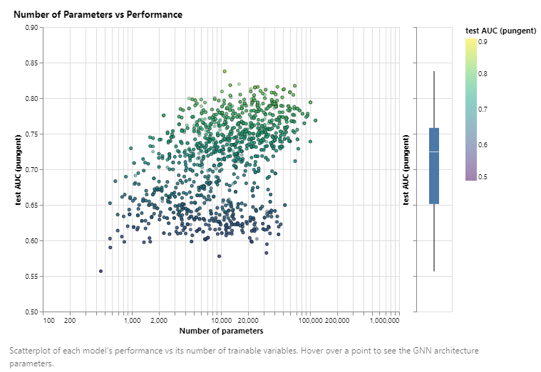

参数增多会使上限提高，但其他超参数也需要更好才可以。

探讨嵌入维度对网络精度的影响。

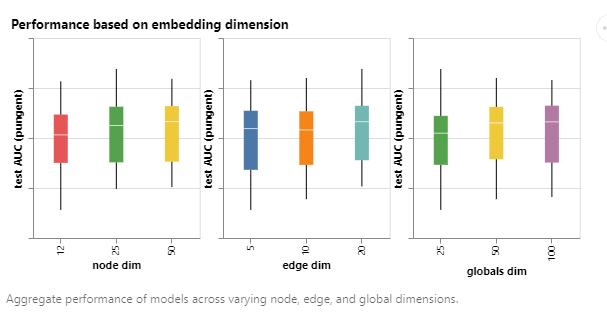

网络层数带来的影响，适当增加可提高精度。

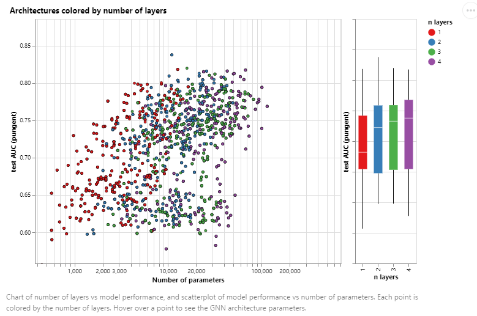

不同的聚合方式基本精度一致。

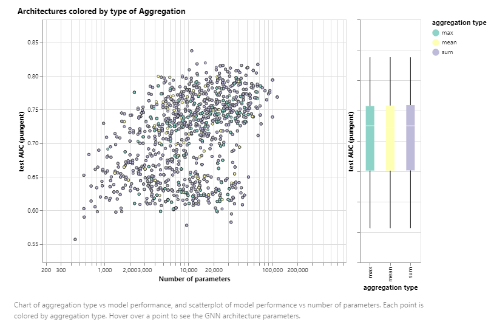

不同的传递信息方式，对模型精度影响较大。传递信息越少，效果越差。

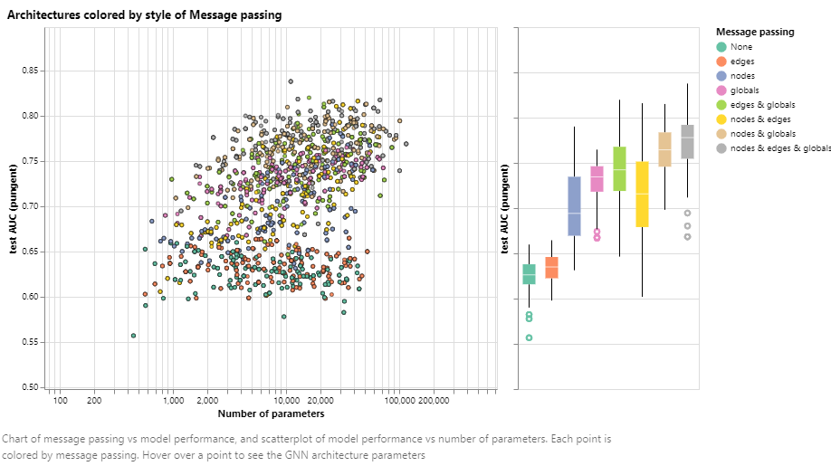

## 1.6 Into the Weeds

讨论GNN相关的技术话题。

### 1.6.1 其他类型的图Other types of graphs (multigraphs, hypergraphs, hypernodes, hierarchical graphs)

边的类型多样，超点。

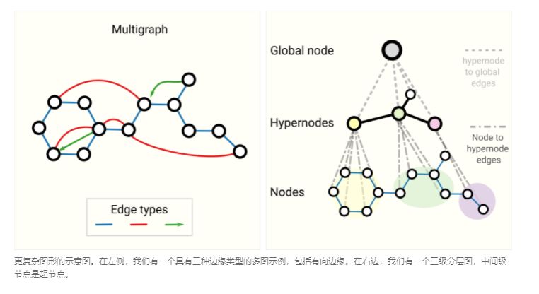

### 1.6.2 采样Sampling Graphs and Batching in GNNs

在小图做信息汇聚，可以减小梯度计算量。

不想对每一个点更新，想使用小批量，但顶点邻居个数不同，需要制作成张量。

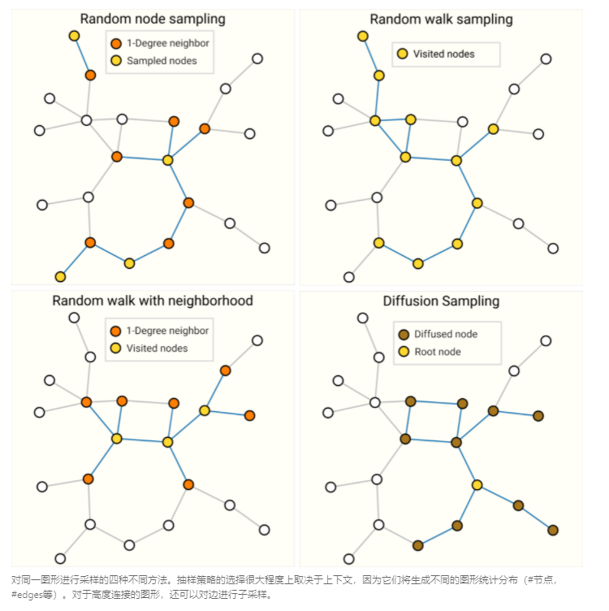

### 1.6.3 Inductive biases

有一些假设。

例如，在图像上标记时，我们希望利用这样一个事实，即狗仍然是狗，无论是在图像的左上角还是右下角。因此，大多数图像模型使用卷积，这是平移不变的。对于文本，令牌的顺序非常重要，因此递归神经网络按顺序处理数据。此外，一个标记（例如单词"not"）的存在会影响句子其余部分的含义，因此我们需要可以"关注"文本其他部分的组件，BERT和GPT-3等变压器模型可以做到这一点。这些是归纳偏差的一些示例，我们正在识别数据中的对称性或规律性，并添加利用这些属性的建模组件。

在图的情况下，我们关心每个图分量（边缘，节点，全局）如何相互关联，因此我们寻找具有关系归纳偏差的模型。模型应保留实体之间的显式关系（邻接矩阵）并保持图形对称性（排列不变性）。我们预计实体之间的相互作用很重要的问题将从图形结构中受益。具体来说，这意味着在集合上设计变换：节点或边上的运算顺序应该无关紧要，运算应该在可变数量的输入上工作。

### 1.6.4 Comparing aggregation operations

比较不同汇聚的操作。

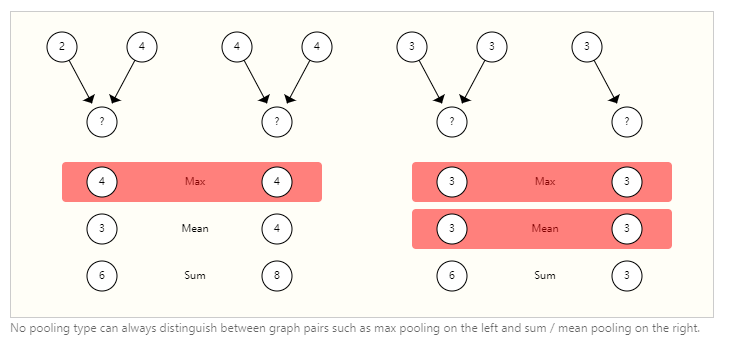

### 1.6.5 GCN as subgraph function approximators

GCN：Graphic Convolutional Networks图卷积神经网络，带汇聚的网络。

使用 1 度邻域查找查看 k 层的 GCN（和 MPNN）的另一种方法是作为神经网络，它对大小为 k 的子图的学习嵌入进行操作。

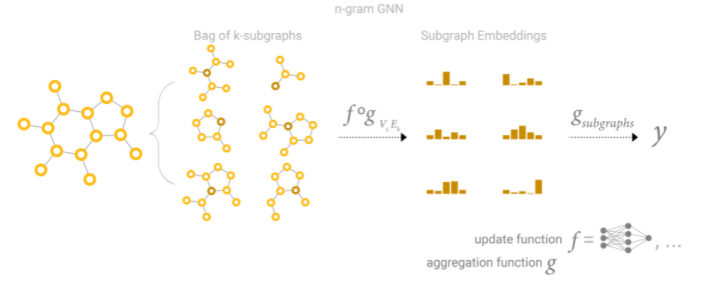

### 1.6.6 边和点的对偶Edges and the Graph Dual

边缘预测和节点预测虽然看似不同，但通常归结为同一个问题：图形上的边缘预测任务。G可以表述为节点级预测G的双重。

### 1.6.7 Graph convolutions as matrix multiplications, and matrix multiplications as walks on a graph

### 1.6.8 Graph Attention Networks

图上的加权和。

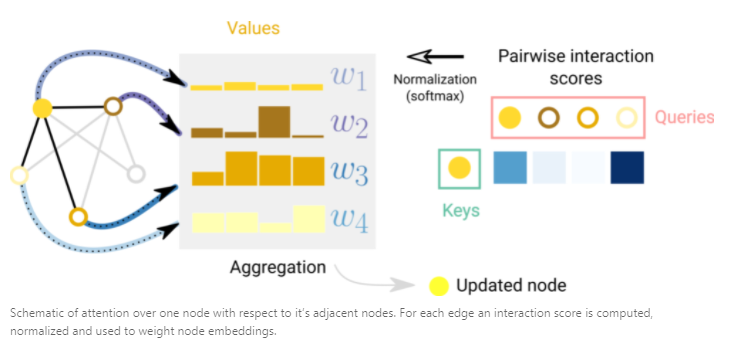

### 1.6.9 可解释性Graph explanations and attributions

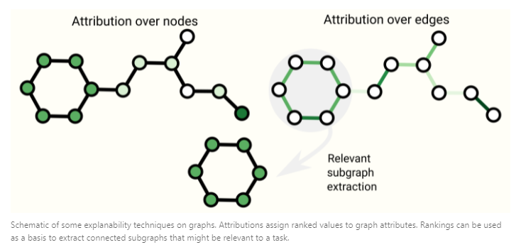

### 1.6.10 生成图的拓扑结构建模Generative modelling

## 1.7 Final thoughts

Graphs are a powerful and rich structured data type that have strengths and challenges that are very different from those of images and text. In this article, we have outlined some of the milestones that researchers have come up with in building neural network based models that process graphs. We have walked through some of the important design choices that must be made when using these architectures, and hopefully the GNN playground can give an intuition on what the empirical results of these design choices are. The success of GNNs in recent years creates a great opportunity for a wide range of new problems, and we are excited to see what the field will bring.

# 2.ViT

