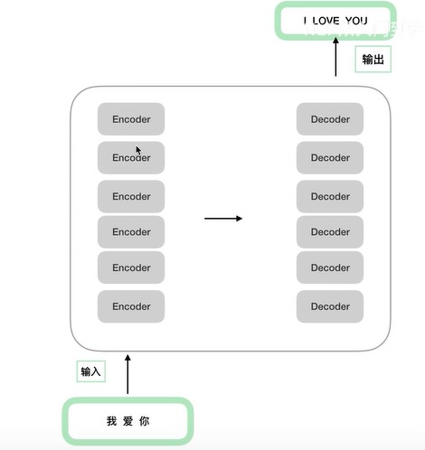
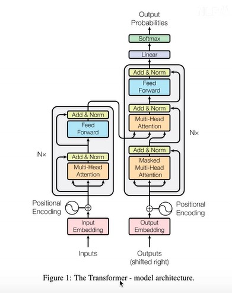
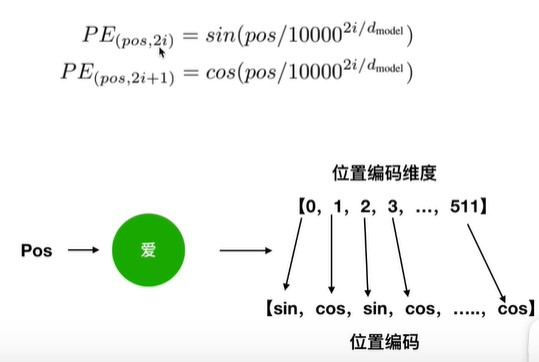
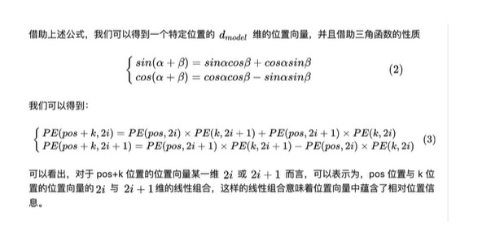

# 0.今日待办

- [x] 卷积总结 resnext
- [x] 卷积总结shuffle net
- [x] 卷积总结 可变形卷积
- [x] 卷积总结 扁平卷积
- [x] 卷积总结 可分离卷积
- [x] 学习笔记总结阅读，Transformer
- [ ] 视频，零基础GAN

# 0.Transformer笔记

本部分摘自master1课程笔记。

# 1. 位置编码

## 1.1 TRM: 从输入到输出

- 编码器解码器结构，从左至右。
- Encoder的结构相同，Decoder的结构相同。结构相同但参数不同。
- 循环结构。

## 1.2 原论文结构

## 1.3 位置编码

### 结构解释

- 自下而上依次是输入部分，注意力机制，前馈神经网络

- 输入部分分为 Embedding和位置编码

- RNN共享一套参数。天然的时序关系。

  

- RNN的梯度消失与普通的梯度消失的不同？

  总梯度被近距离梯度主导，被远距离梯度忽略不计。

- transformer同时把句子中的单词输入进去，增快了速度，但忽略了序列关系。相比RNN，缺少了某些东西告诉网络句子中单词的前后关系，这时需要位置编码。

  

- 位置嵌入

  

- 解释

  绝对位置向量中，蕴含了相对位置向量的信息。

  

  但相对位置信息会在注意力机制那里消失。

# 2.多头注意力机制

## 2.1 基本的注意力机制

### 注意力公式

Q,K,V三个向量，QK做转置乘积，再除以一个数，并进行softmax归一化处理，再乘以V，相当于做了加权和。

- 为什么做点乘？

  点乘是一个向量在另一个向量上的投影长度，可以显示两个向量的相似程度，两个向量越相似，它的结果越大。

  

- attention在nlp中

  

  F函数有三种形式：cos，点乘，mlp。s是点乘的结果。a是相似度结果，相加为1。相乘再相加得到最后的attention value。

## 2.2 在TRM中怎么操作

在只有单词向量的情况下，如何获取QKV三个向量。

- 首先使用三个W矩阵，训练得到。

  

- 具体计算过程。

  下面除以8的原因是，QK乘积值很大，梯度很小，主要是为了控制方差为1。

  

- 实际代码中使用矩阵，方便并行。

- 使用多套QKV，实验中效果确实很好，多头相当于把原始信息打到多个空间，保证transformer能够注意到不同子空间的信息。

  

- 多个头合在一起输出。

  

# 3. 残差和layerNorm

## 3.1 Residual

残差缓解了梯度消失的出现。单独的RNN网络，如果想把网络做深很难，训练很慢。

残差计算

## 3.2 Layer Normalization

### BN

**为什么在这里使用Layer Normalization，而不使用Batch Normalization?**

BN在nlp中效果差，所以不用，有论文对其进行了改进。

#### BN的优点

- 可以解决内部协变量便宜
- 缓解了梯度饱和问题，（如果使用sigmoid激活函数的话），加快收敛。

#### BN缺点

- batchsize比较小的时候，效果很差
- 在RNN中效果差。RNN的输入是动态的，不能有效地得到整个batchsize中的均值和方差。

### LN

**为什么使用Layer Normalization?**

为什么LN单独对一个样本的所有单词做缩放可以起到效果。

# 4. Decoder

decoder

需要mask掉后面所有信息，因为transformer是并行输入，如果不mask掉就能看到全部的信息。

让模型有因果？

encoder生成K V矩阵，decoder生成Q矩阵

encoder的输出和每一个decoder都做交互。

