# 0.今日待办

- [ ] 视频，零基础GNN
- [x] 翻译校对 21-25页
- [x] 翻译校对25-30页
- [x] 翻译校对31-35页
- [x] 翻译校对36-40页

**一个从HTML来的迁移**

# 1. A Gentle Introduction to Graph Neural Networks

本文链接

[图神经网络的简要介绍 (distill.pub)](https://distill.pub/2021/gnn-intro/)

## 一个小结

图是一个非常强大的东西，但是它的强大也带来了很多问题：很难在图上做出优化，图一般比较稀疏，有效的在CPU、GPU、加速器上计算是一件比较难的事情；图神经网络对超参数比较敏感。
图神经网络门槛比较高，这些年吸引了很多人对他的研究，但在工业界上的应用还需要时间的积累。
很多图是交互图（既是优点（非常漂亮）又是缺点（门槛太高，有时用一个公式可以清晰的将其表达出来））。
1.什么是图？图的属性应该用向量来进行表示。对于顶点、边、全局都用向量来表示它的属性。
2.现实生活中的现象怎么表示成图，怎么对顶点、边、全局进行预测？
3.机器学习的算法用到图上有什么挑战？
4.定义GNN：GNN就是对属性做变换，但不改变图的结构。
5.属性有缺失可以做聚合操作，把边的数据拿到结点上面，补足缺失的数据。
6.GNN：每一层里面通过汇聚操作，把信息传递过来，每个顶点看邻接顶点的信息；每个顶点看邻接边的信息或全局的信息。在每一层上如果能对信息进行充分的汇聚，那么GNN可以对图的结构进行一个发掘。
7.实验：做了很多实验，可以看到参数对实验结果的影响。

## 1.1 概览

First, we look at what kind of data is most naturally phrased as a graph, and some common examples. 

Second, we explore what makes graphs different from other types of data, and some of the specialized choices we have to make when using graphs. 

Third, we build a modern GNN, walking through each of the parts of the model, starting with historic modeling innovations in the field. We move gradually from a bare-bones implementation to a state-of-the-art GNN model. 

Fourth and finally, we provide a GNN playground where you can play around with a real-word task and dataset to build a stronger intuition of how each component of a GNN model contributes to the predictions it makes.

一个比较新的领域

A graph represents the relations (*edges*) between a collection of entities (*nodes*).

顶点、边和全局均使用向量表示。

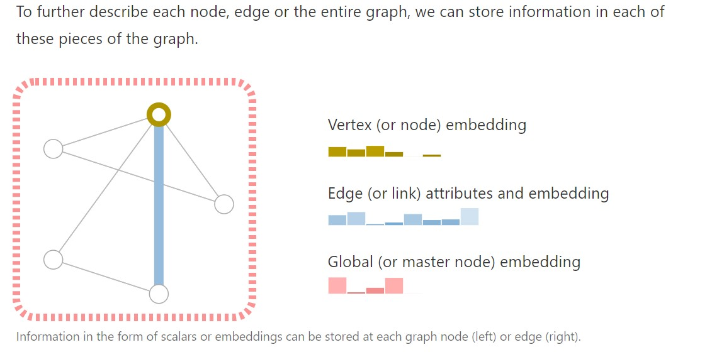

### 图如何表示/得到？

怎么把图片表示成图？

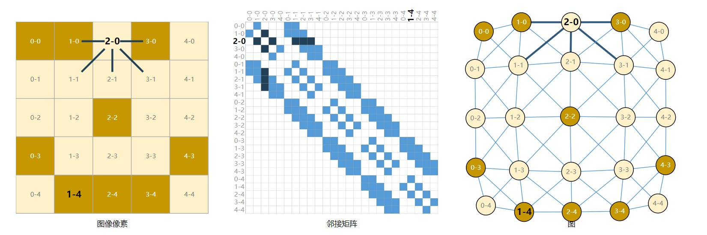

文本、分子结构、社交网络、文章引用，都可以用图表示。

**其他示例。**在计算机视觉中，我们有时想要在视觉场景中标记对象。然后，我们可以通过将这些对象视为节点，将它们的关系视为边缘来构建图形。[机器学习模型](https://www.tensorflow.org/tensorboard/graphs)、[编程代码](https://openreview.net/pdf?id=BJOFETxR-)[12]和[数学方程式](https://openreview.net/forum?id=S1eZYeHFDS)[13]也可以表述为图形，其中变量是节点，边缘是将这些变量作为输入和输出的操作。您可能会在其中一些上下文中看到术语"数据流图"。

### 各类图的大小

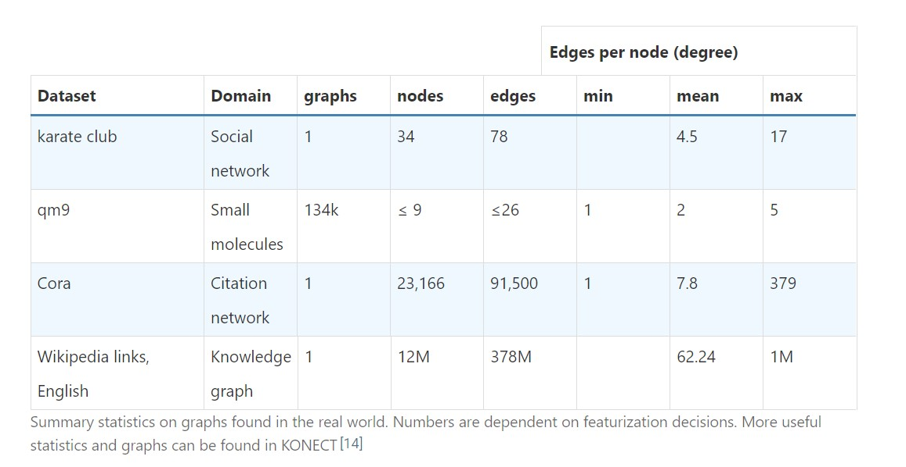

## 1.2 图用来解决哪些问题？

### 1.2.1 graph-level task

分类贴标签，例如，是否有两个环。

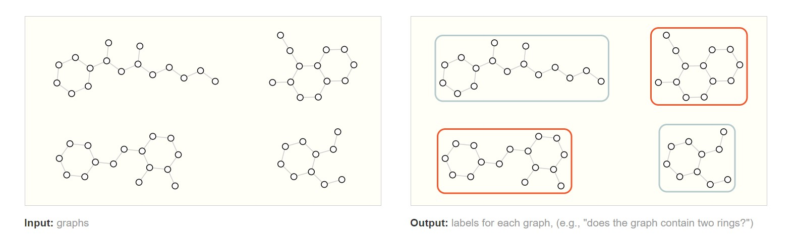

### 1.2.2 node-level task

举例：社交网络图，给两个老师分学生。

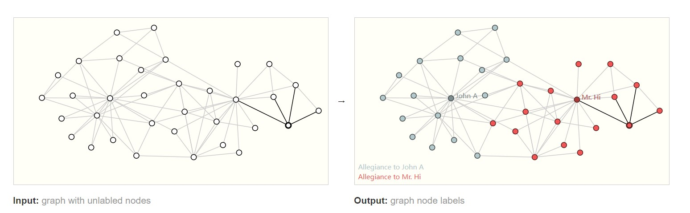

Following the image analogy, node-level prediction problems are analogous to *image segmentation*, where we are trying to label the role of each pixel in an image. With text, a similar task would be predicting the parts-of-speech of each word in a sentence (e.g. noun, verb, adverb, etc).

类似图像分割。

### 1.2.3 edge-level task

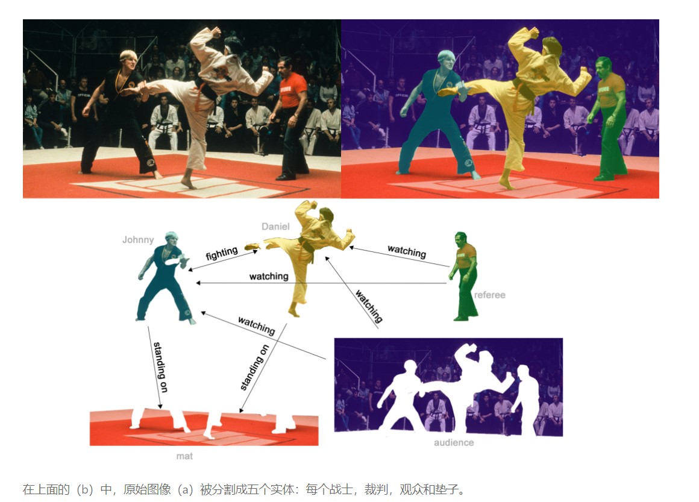

预测边属性。

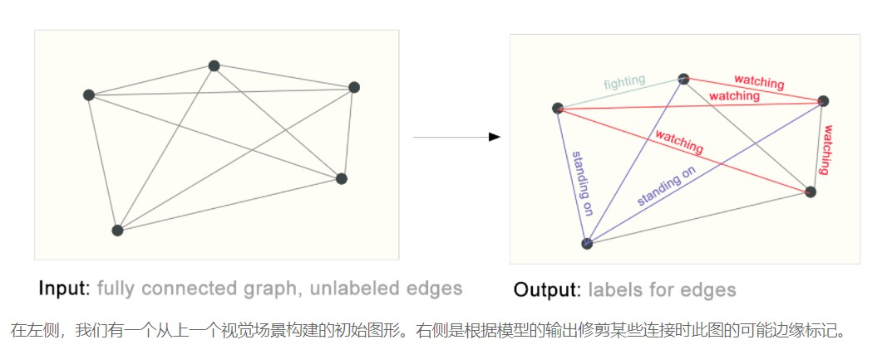

## 1.3 机器学习用在图上的挑战？

Graphs have up to four types of information that we will potentially want to use to make predictions: nodes, edges, global-context and connectivity. 

邻接矩阵可以表示连接性，矩阵稀疏且庞大，高效计算稀疏矩阵困难；行列顺序交换内容一致问题。

可使用邻接表。

表示稀疏矩阵的一种优雅且内存效率强的方法是作为邻接列表。它们描述了节点$n_i$ 和 $n_j$ 之间的边缘 $e_k$ 作为邻接列表的第 k 个条目中的元组 （i，j） 的连接。由于我们期望边的数量远低于邻接矩阵的条目数（$n_{nodes}^2$），因此我们避免在图的断开连接部分上进行计算和存储。

应该注意的是，该图使用每个节点/边/全局的标量值，但大多数实际的张量表示每个图形属性都有向量。我们将处理大小为 $[n_{nodes}]$ 的节点张量，而不是大小为 $[n_{nodes}， node_{dim}]$ 的节点张量。其他图形属性也是如此。

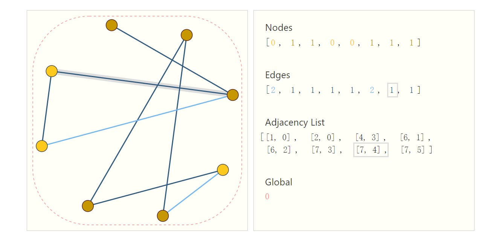

邻接列表储存高效且顺序无关。

## 1.4 Graph Neural Networks

Now that the graph’s description is in a matrix format that is permutation invariant, we will describe using graph neural networks (GNNs) to solve graph prediction tasks. **A GNN is an optimizable transformation on all attributes of the graph (nodes, edges, global-context) that preserves graph symmetries (permutation invariances).** We’re going to build GNNs using the “**message passing neural network**” framework proposed by Gilmer et al.[18] using the Graph Nets architecture schematics introduced by Battaglia et al.[19] GNNs adopt a “**graph-in, graph-out**” architecture meaning that these model types accept a graph as input, with information loaded into its nodes, edges and global-context, and progressively transform these embeddings, **without changing the connectivity of the input graph.**

- GNN输入图，输出图
- 对节点、边和全局信息做变换，优化
- 不改变输入图的连接性（对称性）

### 1.4.1 一个最简单的GNN

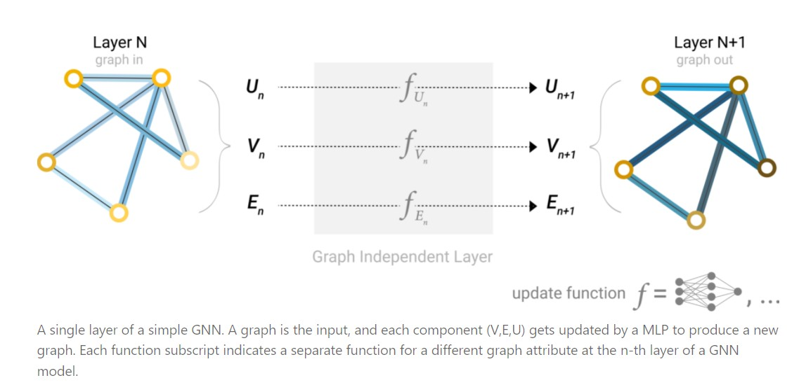

Because a GNN does not update the connectivity of the input graph, we can describe the output graph of a GNN with the same adjacency list and the same number of feature vectors as the input graph. But, the output graph has updated embeddings, since the GNN has updated each of the node, edge and global-context representations.

只更新U、V、E三个属性，保持原图的邻接关系。

### 1.4.2 怎么进行预测？GNN Predictions by Pooling Information

所有的顶点共享一个全连接层、所有的边共享一个全连接层。

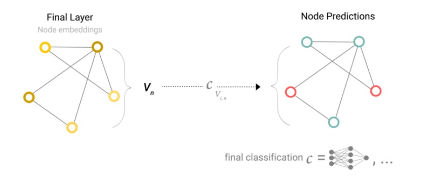

例如，图形中的信息可能存储在边缘中，但节点中没有信息，但仍需要在节点上进行预测。我们需要一种方法从边缘收集信息，并将其提供给节点进行预测。我们可以通过池化做到这一点。

#### 池化的步骤

1. For each item to be pooled, *gather* each of their embeddings and concatenate them into a matrix.
2. The gathered embeddings are then *aggregated*, usually via a sum operation.

我们用字母 $\rho$ 表示*池化*操作，并表示我们正在收集从边缘到节点的信息，如 $p_{E_n \ to V_{n}}$。

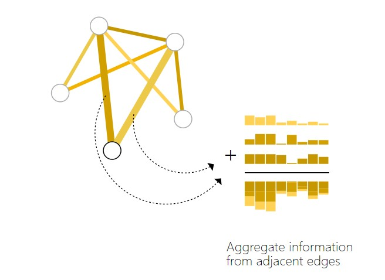

**只有边信息，预测顶点信息。**

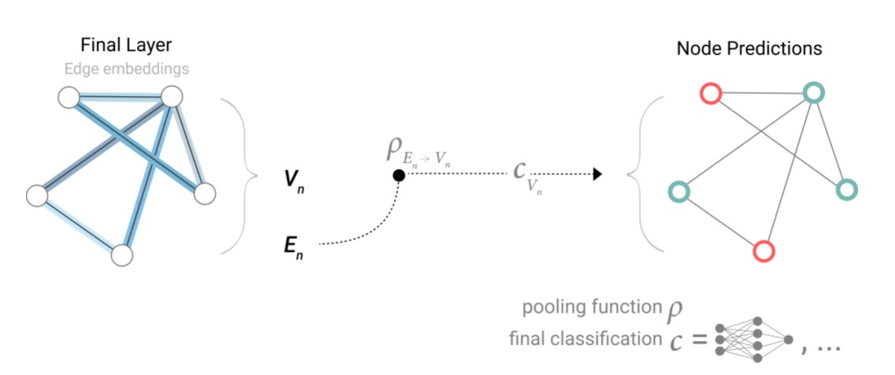

**只有顶点信息，预测边信息。**

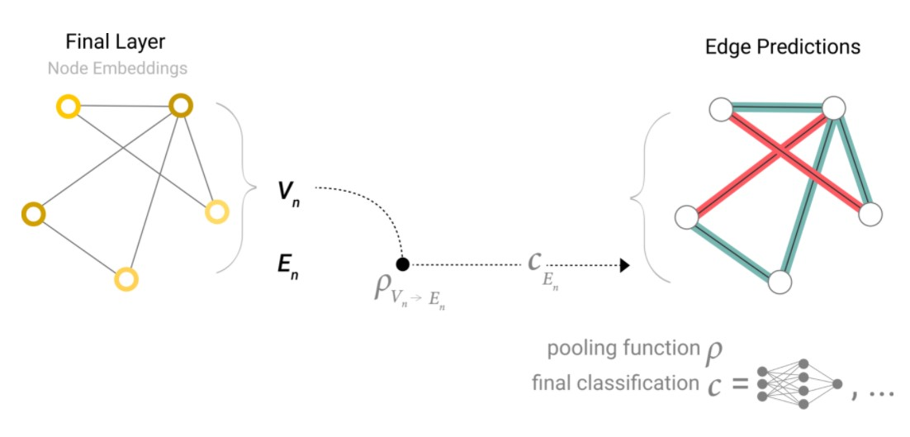

**只有顶点信息，预测全局信息。**全局池化。

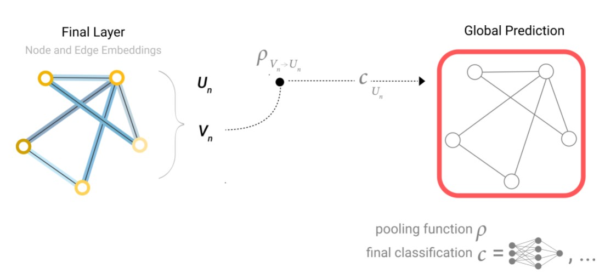

**一个完整的最简单的GNN**

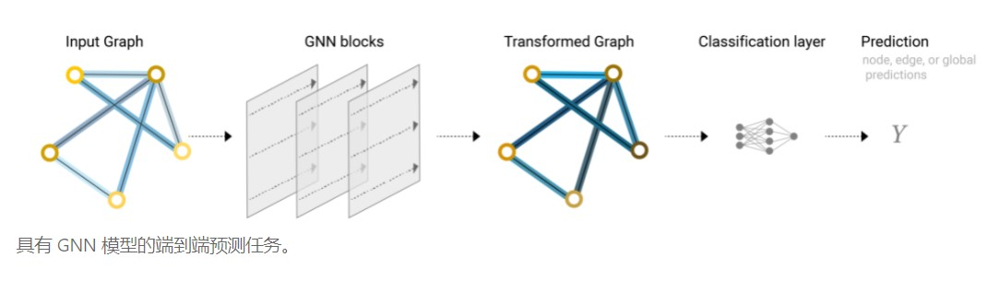

我们没有在GNN层内使用图形的连通性。每个节点都是独立处理的，每个边以及全局上下文也是如此。我们仅在汇集信息进行预测时使用连接。

### 1.4.3 信息传递Passing messages between parts of the graph

信息传递的步骤：

1. For each node in the graph, *gather* all the neighboring node embeddings (or messages), which is the g function described above.
2. Aggregate all messages via an aggregate function (like sum).
3. All pooled messages are passed through an *update function*, usually a learned neural network.

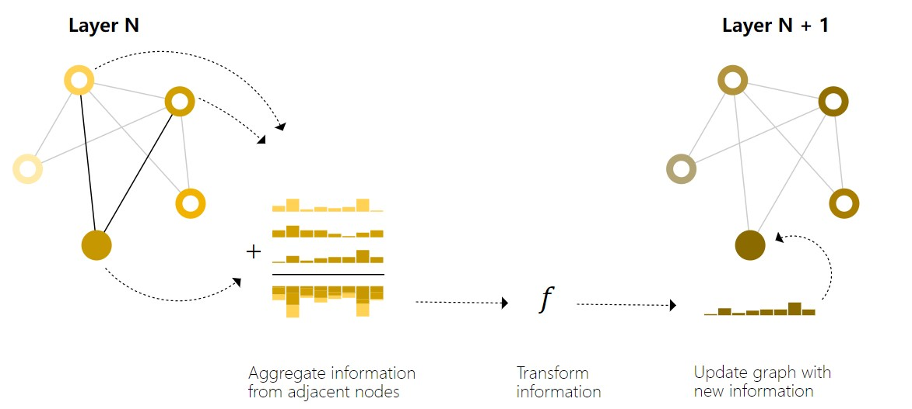

类似卷积，但权重一样。

更新一下架构图。

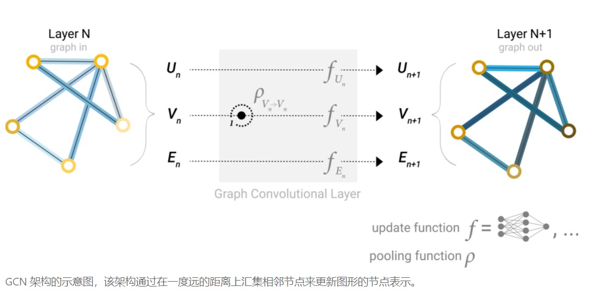

### 1.4.4 Learning edge representations

先用顶点表示边信息，再将边信息汇聚到顶点。

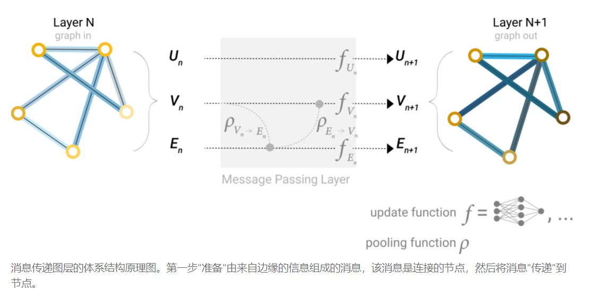

先边嵌入再更新节点嵌入，还是先节点嵌入，再更新边嵌入，会有不同的结果。

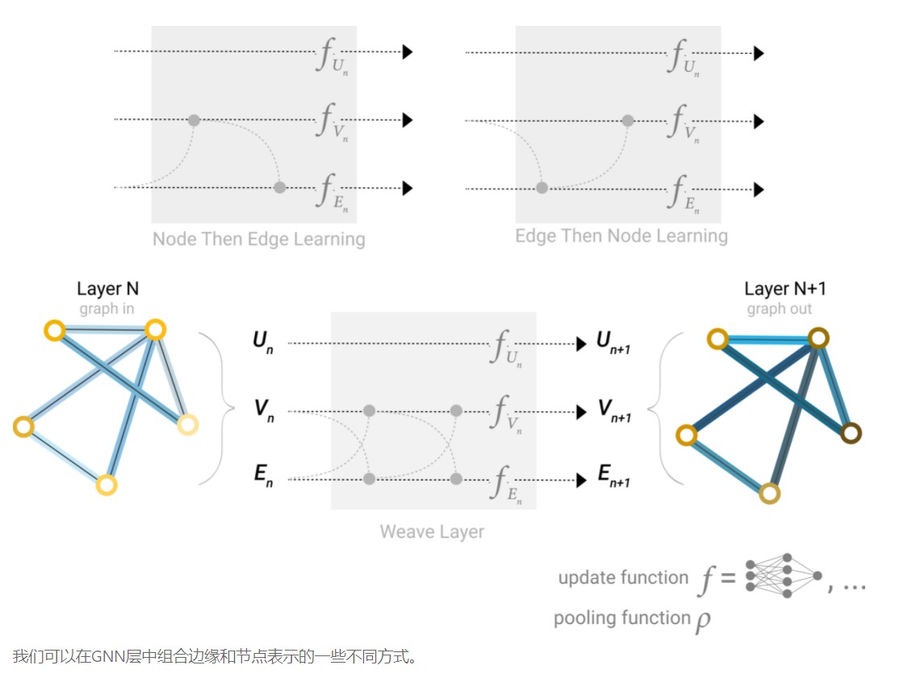

可以交替更新。

### 1.4.5 Adding global representations

Problem: nodes that are far away from each other in the graph may never be able to efficiently transfer information to one another, even if we apply message passing several times. 

One solution to this problem is by using the global representation of a graph (U) which is sometimes called a **master node**.

全局信息类似一个虚拟节点。

**全局更新**

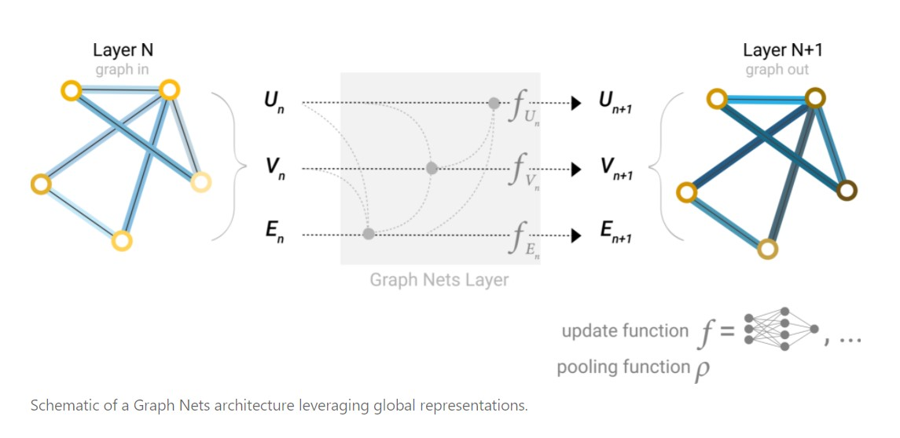

