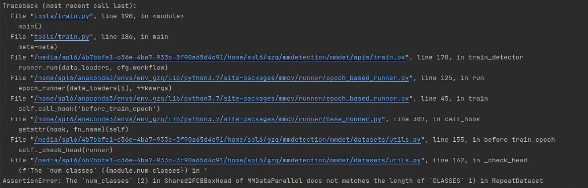
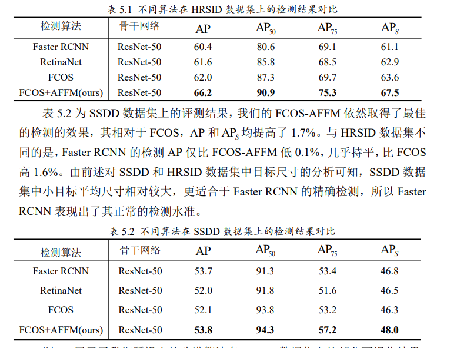
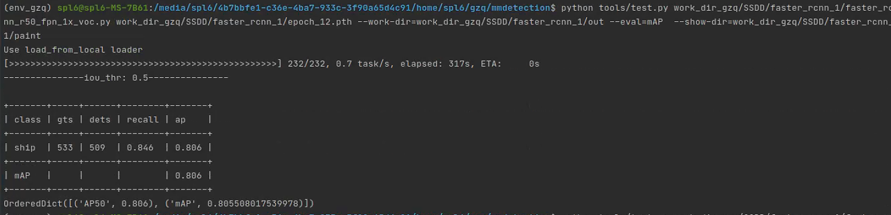

# 1.Faster RCNN训练SSDD数据集

## 1.1 数据集处理

voc格式数据处理，把尾数1和9当做测试集，0当做验证集。

## 1.2 训练过程踩雷

### bug1

img_prefix无VOC2012或VOC2007，数据必须在VOC命名的文件夹内，踩雷。

### bug2

config中类别信息不能加背景标签，即不加1。

## 1.3 一个记录

来自师兄加卓鹏论文

### 实验结果

首先复现出论文中的效果，但其采用的数据集划分方法不一样，可能结果不同，但效果不能差距太大。

### 参数设置

### 今天的测试结果

