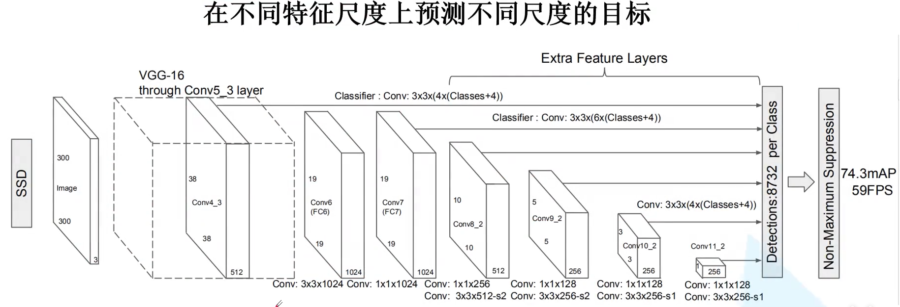
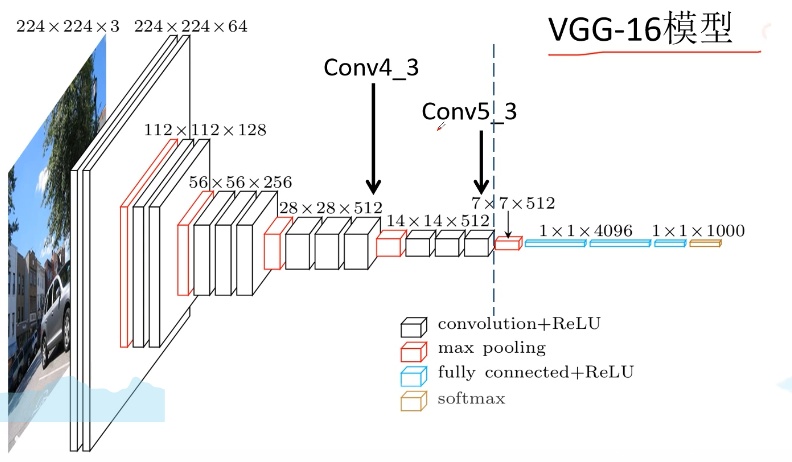
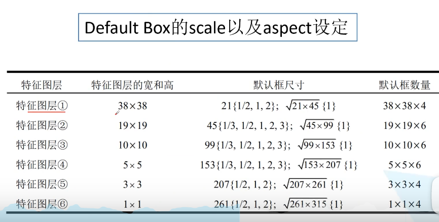
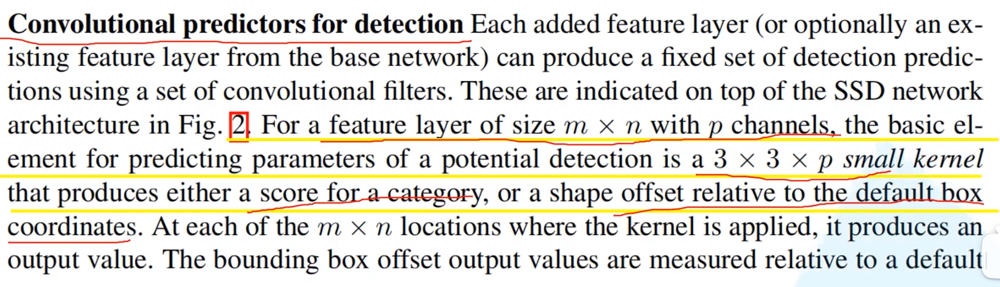
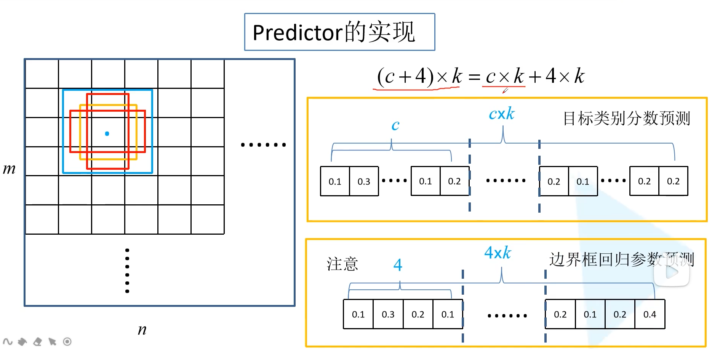
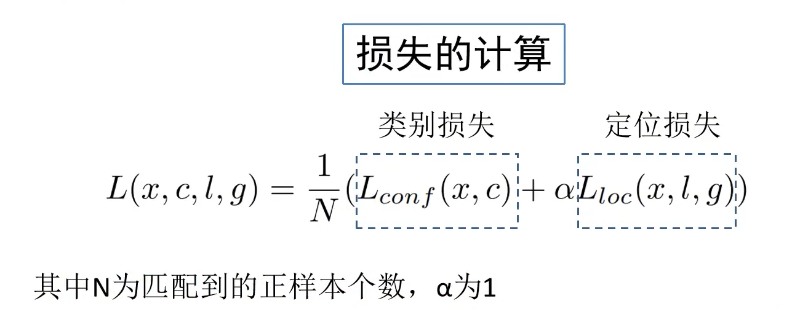
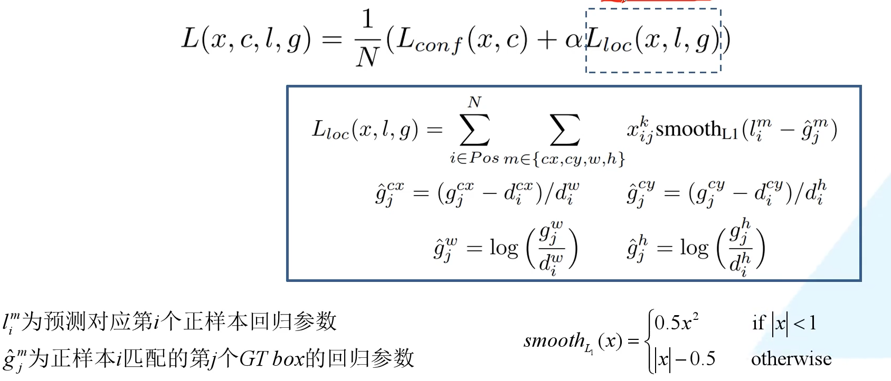
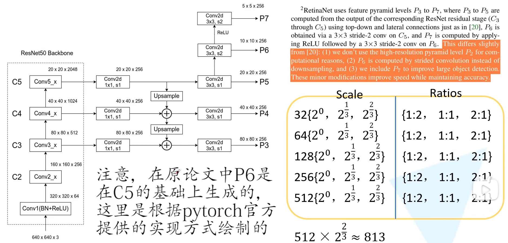
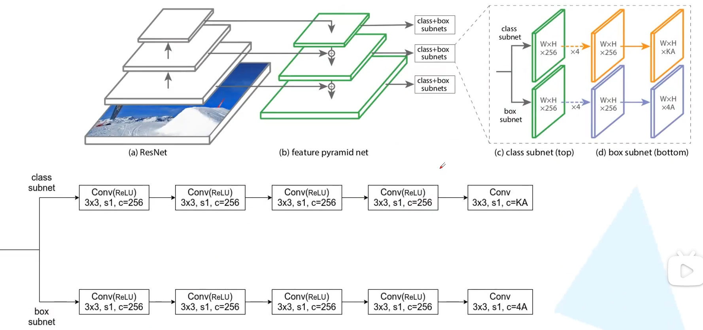

# SSD

## Faster rcnn存在的问题

- faster rcnn对小目标检测效果较差
- 模型大，检测速度慢。

## SSD模型架构

Single Shot MultiBox Detector

VGG16做backbone

FC6对应第一个全连接层，FC7对应第二个全连接层。

conv4_3的输出是第一个预测特征层

maxpoll5的时候，将池化核大小从2x2步距=2修改为3x3,步距为1。则原本应该缩小为一半的高和宽保持不变。

FC7对应的是第二个预测特征层，后接预测特征层3456

## 如何计算default box的scale以及aspect设定

共生成38x38x4+...+1x1x4=8732，生成8732个框。aspect为生成框的宽高比。

## 预测器predictor实现

这里和faster rcnn类似。

每个位置生成k个box，生成c个类别分数和4个坐标偏移量。最终的卷积核（c+4)xk

c包括背景类别。

注意：faster rcnn对于每个anchor生成4c个边界框回归参数，针对每一个anchor会生成每一个类别的边界框回归参数，SSD对于每个box，只生成4个边界框回归参数，不关注类别。

## 正负样本选取

正样本匹配准备:每个gtbox，匹配与其iou值最大的box；对于任意的box，只要它和任意的gtbox交并比大于0.5，也当做正样本。

生成了8732个default box，不能全部拿来训练。

选负样本的准则：选较高的confidence loss，负样本和正样本比例3:1。

Hard negative mining

## Loss计算

### 类别损失

$$
L_{\text {conf }}(x, c)=-\sum_{i \in P o s}^{N} x_{i j}^{p} \log \left(\hat{c}_{i}^{p}\right)-\sum_{i \in N e g} \log \left(\hat{c}_{i}^{0}\right) \quad \text { where } \quad \hat{c}_{i}^{p}=\frac{\exp \left(c_{i}^{p}\right)}{\sum_{p} \exp \left(c_{i}^{p}\right)}
$$

$\quad \hat{c}_{i}^{p}$为预测的第i个default box对应GTbox（类别是P）的概率；

$x_{i j}^{p}= {0,1}$为第i个default box匹配到的第j个GT BOX，类别是P

softmax 损失计算方法

# RetinaNet

Focal loss for Dense Object Detection

并没有使用C2，其会占用更多的空间。FPN的backbone。P6通过最大池化下采样，而这里是用卷积采样，P6通过relu再卷积得到P7。

使用九组anchor

使用权值共享的预测器，

## 正负样本匹配

大于等于0.5为正样本，小于0.4为负样本，其他舍弃。

