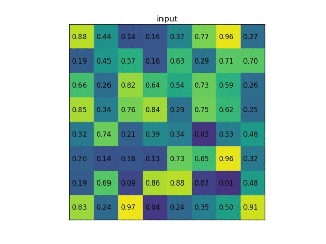

# Related work

## 2.1 Oriented Bounding Box Regression

## 2.2 Spatial-invariant Feature Extraction

具有空间不变性的特征提取

问题：CNN空间不变性效果很差，只有平移不变性，尺度和旋转变化表现差。

解决：Spatial Transformer，DCN

没有额外监督的情况下，从目标中学习。

问题：区域特征提取region feature extraction

解决：deformable roi pooling（对roi pooling采用网络进行偏移学习）

问题：遥感图像几乎没有非刚性变形，本网络只模拟刚性变形

特点：从gt中学习偏移

## 2.3 Light RoI-wise Operations

问题：roi wise操作是两阶段算法效率的瓶颈，因为计算不共享

解决：Light head RCNN

- 使用更大的可分离卷积获得细特征
- 使用PS roi pooling降低特征图位数
- 10维池化特征上应用单个全连接层，提高算法速度

操作类似deformable roi pooling，其中roi操作进行了两次

# 3. ROI transformer

- rroi learner

  PS roi algin后跟一个5维全连接层，用来回归rotated gt和hroi的偏移量

- rroi warping

  变换rotated region features以保证旋转不变性，这两个操作对于端到端训练来说都可微。

# 4. Light head RCNN

针对于R-FCN对roi层的P(C+1)个channel的特征层进行压缩，原P为7*7，这里取C+1=10，取490channels，类别数目不一致了，加入一个FC层再回归和分类。

## light-head RCNN VS Faster RCNN

- 在精度上，Faster RCNN为了减少全连接层的计算量，使用了Global average pooling操作，这会导致在一定程度上丢失位置信息；
- 在速度上，Faster RCNN的每一个ROI都要通过R-CNN subnet做计算，这必将引起计算量过大，导致检测速度慢。

## Light-Head RCNN VS R-FCN

- R-FCN解决了每个ROI都要经过R-CNN subnet导致重复计算的问题；
- 在精度上，R-FCN也使用了global average pool;（用来对score map进行分数合并）
- 在速度上，R-FCN的head虽然不用计算每一个ROI，但其需要一个维度很大的score map（和滑动窗口大小和类别数有关），这在一定程度上也会降低检测速度。

# 5.一个关于pooling池化的总结

https://zhuanlan.zhihu.com/p/112000358

一般来说，目标检测中的Pooling操作（这里特指stage one和stage two之间的连接pooling），可以理解为对stage  one中提取的Anchor的一个信息整合操作，在尽可能提取有效信息的前提下将Anchor的feature  map的size统一，以便于其作为stage two的神经网络的常规输入。在Faster  R-CNN之前，一般是直接将各个size的Anchor源feature map拉伸压缩到同一个size。而到了Faster  R-CNN，采用了RoI Pooling的方式，即将经过backbone之后的feature map，平均的切割成k*k个bin，做max  Pooling。在Mask R-CNN中，采用了浮点数切割并使用了双线性插值，即RoI Align。而后PrRoI Pooling对RoI  Align进一步精细化，采用积分的方式来Pooling。除此之外，还有考虑加入位置信息的PSRoI  Pooling，以及可变形的Deformable RoI Pooling。

## ROI pooling

在Faster R-CNN中提出，将经过backbone之后的feature map，Pooling到同一个size。这是一个很自然的想法，在HOG等以前的方法中，都具有这样的思想。但是这个方法有一个主要的缺点：需要进行2次量化取整的操作，会带来**精度的损失**

首先，ROI Pooling涉及到的2次量化操作，每进行一次都会有精度的损失。第一次是ROI  pooling之前预测的边界框是个float数值，而不是整数，这样就涉及到一次取整的操作，取整后才可以输入ROI Pooling。第二次是ROI Pooling需要对提取的ROI做pooling操作，输出一个7*7大小的feature  map，即7*7个bin。这样ROI的长度或者宽度除以7，得到的也是一个float数值，而非整数，这个时候又涉及到一次量化取整的操作。

## ROI align

出自mask rcnn

ROI Align是ROI Pooling的改进版，并且针对ROI  Pooling的缺点——两次取整操作引起的误差，进行了改进，将取整操作改为两次都取浮点数，并且引入了采样点的概念。在这里首先使用了双线性插值的方式（如上图所示），认为对于任意的浮点数坐标（x,y），其像素值可以由其最近邻的四个方向的整数坐标点 $\left(x_{1}, y_{2}\right), \left(x_{1}, y_{1}\right),\left(x_{2}, y_{1}\right),\left(x_{2}, y_{2}\right)$ 的像素值计算得到。具体计算方法如图所示，即4个真实像素点的面积值加权(双线性插值)。

ROI Align的计算流程如下：

1. 由输入的ground truth box大小，经过backbone的缩放（比如32），得到输出的shared layer中ground truth box大小（浮点数而不是整数）；
2. 对于缩放后的ground truth box，将其平均分为（n，n）大小的小块（这里的n即为pooling后的anchor的边长）；
3. 对于每个小块，假设我们的采样率为2，那么在每个小块内，要采样2x2=4个点，四个点的位置按小块内的1/4,3/4位置取；
4. 按双线性插值计算4个点的像素值，取4个点中的像素值max作为这个小块的像素值。

缺点：

ROI区域中的每个bin区域中引入了新的参数，即需要插值的点的数目N。并且这个N是预先设定的，无法根据feature map做自适应调整。

这N个点的梯度只与其上下左右4个整数位置的像素点有关，而不是整个区域的像素点都有梯度的传递。

## Precise ROI Pooling（PrRoI Pooling）

Precise ROI Pooling（PrRoI Pooling）方法由旷视科技于ECCV 2018上提出，作为他们的论文[Acquisition of Localization Con dence for Accurate Object Detection](https://link.zhihu.com/?target=https%3A//eccv2018.org/openaccess/content_ECCV_2018/papers/Borui_Jiang_Acquisition_of_Localization_ECCV_2018_paper.pdf)中的一部分。

PrRoI Pooling可以看成RoI Align的一个改进版，将插值的点的数目N改为直接积分，这样就不需要指定参数N。即RoI  Align是从小方块中寻找最具代表性的点来代表这个小方块，而PrRoI Pooling则是直接计算这个小方块内的所有点的平均值来代表这个小方块。

上图归纳了RoI Pooling，RoI Align及PrRoI  Pooling的不同计算方式（不过2中公式里应该是max，而不是/N？）。PrRoI Pooling前面的得到小方块坐标的计算步骤都与RoI  Align一致。在计算小方块的像素值时，使用积分的方式，对所有小方块内的像素点进行积分（由于像素点连续且使用了双线性插值的方法，具体的积分可以看成是小方块按整数像素点切割成若干块，对于每一块求其中心点的像素值即为这块的积分值，然后将这若干块的积分值按面积加权相加）。

思考和讨论：毋庸置疑PrRoI Pooling消除了插值的点的数目这个参数，也可以理解为对于不同大小的方块，按方块大小（及方块内整数像素点的多少）来得到这个参数值。有两点想讨论

1. RoI Align中可以看成是使用max pooling，而PrRoI Pooling中使用的是average pooling，两者孰更优（比如在RoI Align中也按相素点数来取点的数目，然后和PrRoI Pooling比对）？
2. 更远一点，当这个方块比较大（包含的整数像素点比较多）的时候，怎么Pooling比较合适？是max还是average？是取多一些的相素点数还是少一些？

## PSROI Pooling

PSROI Pooling（Position Sensitive ROI-Pooling）第一次出现在[R-FCN](https://link.zhihu.com/?target=https%3A//arxiv.org/abs/1605.06409)（NIPS2016）中。在一般的场景中，很多目标出现的位置往往有一定的规律，如果能有效利用这些信息，可能会提升判别结果。在R-FCN中，提出了PSRoI Pooling替代RoI Pooling,通过channel的方式引入位置敏感信息,有效缓解检测网络的目标平移不变性问题。

PSRoI Pooling的计算过程入上图所示，在计算shared layer时，将channel这一维度大小设置为 $k^2(C+1)$ ，这里k指pooling之后的feature map边长，C为类别数量。通过这样的操作，由于不同channel包含各自位置的信息，就可以认为在shared layer的每一个像素点，都有不同位置的信息。在做PSRoI Pooling时，将$(w,h)*k^2(C+1)$ 大小的box pooling成$k*k*(C+1)$的box，即w*h的特征average pooling成1个值。

思考：当需要引入位置信息时，可以考虑channel这个维度。

## Deformable RoI Pooling

出自[Deformable Convolutional Networks](https://link.zhihu.com/?target=https%3A//arxiv.org/pdf/1703.06211.pdf)，后又出了DCNv2，RepPoints等改进版。

如上图所示，给定一个输入RoI，RoI pooling将它分成 K 个bins。首先通过RoI pooling得到池化后的feature maps，然后通过一个fc层产生归一化偏移量$\Delta \hat{p}_{k}$ (该偏移量可以转化为 $\Delta p_k$  )。

$p_{k j}$ 表示为第 K 个bin的第 j 个采样点的位置，$ n_{k}$表示为第 k 个bin的采样点数量。  通过双线性插值得到。  $x\left(p_{k j}+\Delta p_{k}\right)$为$\Delta p_k$ 第 K 个bin的偏移量。

单个bin的输出特征可表示为：
$$
y(k)=\sum_{j=1}^{n_{k}} x\left(p_{k j}+\Delta p_{k}\right) / n_{k}
$$

思考：Deformable RoI Pooling引入了更多的训练参数，使得网络对不同size的box的表达能力更强，亦可以理解成Spatial Transformer Network的一种延伸。