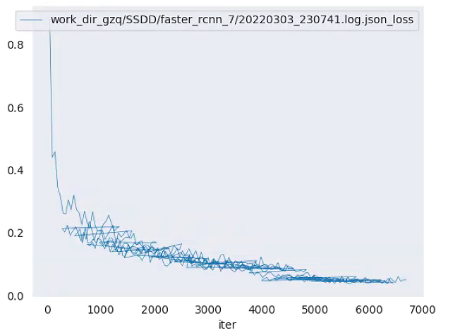
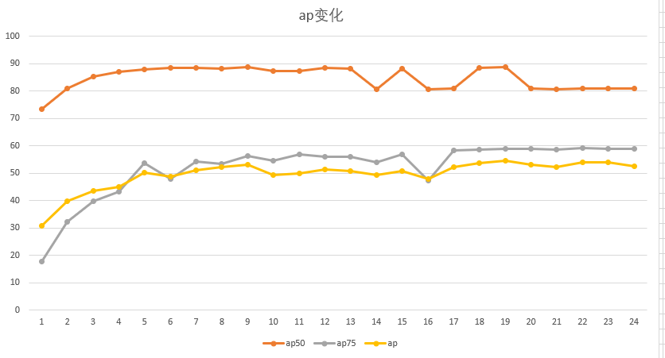

# 1.训练

SGD换Adam

loss

本次训练中ap，ap50和ap75的折线图。

修改config使其能够运行tensorboard。报错

 AttributeError: ‘ConfigDict‘ object has no attribute ‘pipeline‘

**solution**

删掉datatype=repeat data的三行。

# faster rcnn训练逐步

1.train.py

# BN, GN, LN, IN

## BN

## GN

## LN

## IN