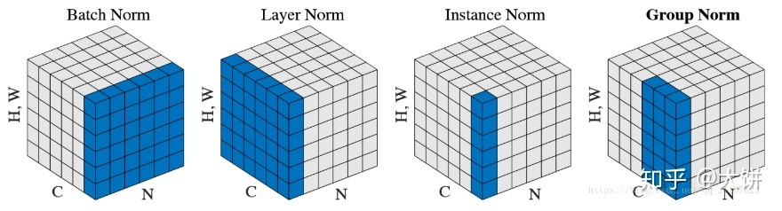

# 1.正则化方法

参考：[BN、LN、IN、GN的简介 - 知乎 (zhihu.com)](https://zhuanlan.zhihu.com/p/91965772)

神经网络中有各种归一化算法：Batch Normalization (BN)、Layer Normalization (LN)、Instance Normalization (IN)、Group Normalization (GN)。
$$
y=\gamma\left(\frac{x-\mu(x)}{\sigma(x)}\right)+\beta
$$
这些归一化算法的主要**区别在于操作的 feature map 维度不同**。



## BN

Batch Normalization (BN) 是最早出现的，也通常是效果最好的归一化方式。feature map： $x \in \mathbb{R}^{N \times C \times H \times W}$ ,包含 N 个样本，每个样本通道数为 C，高为 H，宽为 W。对其求均值和方差时，将在 N、H、W上操作，而保留通道 C 的维度。具体来说，就是把第1个样本的第1个通道，加上第2个样本第1个通道 ...... 加上第 N 个样本第1个通道，求平均，得到通道 1 的均值（注意是除以 N×H×W 而不是单纯除以 N，最后得到的是一个代表这个 batch 第1个通道平均值的数字，而不是一个 H×W 的矩阵)。求通道 1 的方差也是同理。对所有通道都施加一遍这个操作，就得到了所有通道的均值和方差。
$$
\begin{gathered}
u_{c}(x)=\frac{1}{N H W} \sum_{n=1}^{N} \sum_{h=1}^{H} \sum_{w=1}^{W} x_{n c h w} \\
\sigma_{c}(x)=\sqrt{\frac{1}{N H W} \sum_{n=1}^{N} \sum_{h=1}^{H} \sum_{w=1}^{W}\left(x_{n c h w}-\mu_{c}(x)\right)^{2}+\epsilon}
\end{gathered}
$$
类比为一摞书，这摞书总共有 N 本，每本有 C 页，每页有 H 行，每行 W 个字符。BN 求均值时，相当于把这些书按页码一一对应地加起来（例如第1本书第36页，第2本书第36页......），再除以每个页码下的字符总数：N×H×W，因此可以把 BN 看成求“平均书”的操作（注意这个“平均书”每页只有一个字），求标准差时也是同理。

torch实现：

```python
# coding;utf8
import torch
from torch import nn

# track_running_stats=False，求当前 batch 真实平均值和标准差，
# s
# affine=False, 只做归一化，不乘以 gamma 加 beta（通过训练才能确定）
# num_features 为 feature map 的 channel 数目
# eps 设为 0，让官方代码和我们自己的代码结果尽量接近

bn = nn.BatchNorm2d(num_features=3, eps=0, affine=False, track_running_stats=False)

x = torch.randn(10, 3, 5, 5)*10000 #x.shape:[10,3,5,5]
official_bn = bn(x)

# 把 channel 维度单独提出来，而把其它需要求均值和标准差的维度融合到一起

# x.permute(1, 0, 2, 3).shape: [c,n,h,w]
# x.permute(1, 0, 2, 3).contiguous(): [c,n,h,w]
# x.permute(1, 0, 2, 3).contiguous().view(3, -1): [c, n x h x w]


# x1 = x.permute(1, 0, 2, 3).contiguous().view(3, -1)
# 先转置0,1维度转置（这里内存并没有改变格式，仍然顺序存储，再contiguous连接，才能够正确view）
# 3,10,5,5-》3,250
x1 = x.transpose(0,1).contiguous().view(3,-1)

# x1.mean(dim=1).shape: [3]
mu = x1.mean(dim=1).view(1, 3, 1, 1)

# unbiased=False, 求方差时不做无偏估计（除以 N-1 而不是 N），和原始论文一致 unbiased = False
# x1.std(dim=1).shape: [3]
std = x1.std(dim=1, unbiased=False).view(1, 3, 1, 1)
my_bn = (x - mu)/std

diff = (official_bn - my_bn).sum()
print(my_bn)

print('diff={}'.format(diff))
```

## LN

Batch Normalization 的一个缺点是**需要较大的 batchsize 才能合理估训练数据的均值和方差(横向计算)，这导致内存很可能不够用**，同时它也**很难应用在训练数据长度不同的 RNN 模型上**。Layer Normalization (LN) 的一个优势是不需要批训练，在单条数据内部就能归一化。
对于 $x \in \mathbb{R}^{N \times C \times H \times W}$ , LN 对每个样本的 C、H、W 维度上的数据求均值和标准差，保留 N 维度。
$$
\begin{gathered}
u_{n}(x)=\frac{1}{C H W} \sum_{c=1}^{C} \sum_{h=1}^{H} \sum_{w=1}^{W} x_{n c h w} \\
\sigma_{n}(x)=\sqrt{\frac{1}{C H W} \sum_{c=1}^{C} \sum_{h=1}^{H} \sum_{w=1}^{W}\left(x_{n c h w}-\mu_{n}(x)\right)^{2}+\epsilon}
\end{gathered}
$$
把一个 batch 的 feature 类比为一摞书。LN 求均值时，相当于把每一本书的所有字加起来，再除以这本书的字符总数：C×H×W，即求整本书的“平均字”，求标准差时也是同理。

```python
# coding;utf8
import torch
from torch import nn

x = torch.randn(10, 3, 5, 5)*10000 #x.shape:[10,3,5,5]

# normalization_shape 相当于告诉程序这本书有多少页，每页多少行多少列
# eps=0 排除干扰
# elementwise_affine=False 不作映射
# 这里的映射和 BN 以及下文的 IN 有区别，它是 elementwise 的 affine，
# 即 gamma 和 beta 不是 channel 维的向量，而是维度等于 normalized_shape 的矩阵
ln = nn.LayerNorm(normalized_shape=[3,5,5], eps=0, elementwise_affine = False)

official_ln = ln(x)

# 把 channel 维度单独提出来，而把其它需要求均值和标准差的维度融合到一起
x1 = x.contiguous().view(10, -1)

# x1.mean(dim=1).shape: [10]
mu = x1.mean(dim=1).view(10, 1, 1, 1)

# unbiased=False, 求方差时不做无偏估计（除以 N-1 而不是 N），和原始论文一致 unbiased = False
# x1.std(dim=1).shape: [3]
std = x1.std(dim=1, unbiased=False).view(10, 1, 1, 1)
my_ln = (x - mu)/std

diff = (official_ln - my_ln).sum()
print(my_ln)

print('diff={}'.format(diff))
```

## IN

**Instance Normalization (IN) 最初用于图像的风格迁移**。**作者发现，在生成模型中， feature map 的各个 channel 的均值和方差会影响到最终生成图像的风格，因此可以先把图像在 channel 层面归一化，然后再用目标风格图片对应 channel 的均值和标准差“去归一化”，以期获得目标图片的风格**。**IN 操作也在单个样本内部进行，不依赖 batch**。
对于 $x \in \mathbb{R}^{N \times C \times H \times W}$ ，IN 对每个样本的 H、W 维度的数据求均值和标准差，保留 N 、C 维度，也就是说，它只在 channel 内部求均值和标准差，其公式为：
$$
\begin{gathered}
u_{n c}(x)=\frac{1}{H W} \sum_{h=1}^{H} \sum_{w=1}^{W} x_{n c h w} \\
\sigma_{n c}(x)=\sqrt{\frac{1}{H W} \sum_{h=1}^{H} \sum_{w=1}^{W}\left(x_{n c h w}-\mu_{n c}(x)\right)^{2}+\epsilon}
\end{gathered}
$$
IN 求均值时，相当于把一页书中所有字加起来，再除以该页的总字数：H×W，即求每页书的“平均字”，求标准差时也是同理。

```python
import torch
from torch import nn


x = torch.rand(10, 3, 5, 5) * 10000

# track_running_stats=False，求当前 batch 真实平均值和标准差，
# 而不是更新全局平均值和标准差
# affine=False, 只做归一化，不乘以 gamma 加 beta（通过训练才能确定）
# num_features 为 feature map 的 channel 数目
# eps 设为 0，让官方代码和我们自己的代码结果尽量接近

In = nn.InstanceNorm2d(num_features=3, eps=0, affine=False, track_running_stats=False)

offcial_in = In(x)

x1 = x.view(30, -1)
mu = x1.mean(dim=1).view(10, 3, 1, 1)
std = x1.std(dim=1, unbiased=False).view(10, 3, 1, 1)

my_in = (x - mu)/std

diff = (my_in - offcial_in).sum()
print('diff={}'.format(diff))
```

## GN

**Group Normalization (GN) 适用于占用显存比较大的任务，例如图像分割**。对这类任务，可能 batchsize 只能是个位数，再大显存就不够用了。而当 batchsize 是个位数时，BN 的表现很差，因为没办法通过几个样本的数据量，来近似总体的均值和标准差。**GN 也是独立于 batch 的，它是 LN 和 IN 的折中**。

GN 计算均值和标准差时，把每一个样本 feature map 的 channel 分成 G 组，每组将有 C/G 个 channel，然后将这些 channel 中的元素求均值和标准差。各组 channel 用其对应的归一化参数独立地归一化。
$$
\begin{gathered}
u_{n g}(x)=\frac{1}{(C / G) H W} \sum_{c=g C / G}^{(g+1) C / G} \sum_{h=1}^{H} \sum_{w=1}^{W} x_{n c h w} \\
\sigma_{n g}(x)=\sqrt{\frac{1}{(C / G) H W} \sum_{c=g C / G}^{(g+1) C / G} \sum_{h=1}^{H} \sum_{w=1}^{W}\left(x_{n c h w}-\mu_{n g}(x)\right)^{2}+\epsilon}
\end{gathered}
$$
GN 相当于把一本 C 页的书平均分成 G 份，每份成为有 C/G 页的小册子，求每个小册子的“平均字”和字的“标准差”。

```python
import torch
from torch import nn


x = torch.rand(10, 20, 5, 5)*10000
# 分成 4 个 group
gn = nn.GroupNorm(num_groups=4, num_channels=20, eps=0, affine=False)
official_gn = gn(x)

#把同一个group的元素融合到一起
# 分成 4 个 group

x1 = x.view(10, 4, -1)
mu = x1.mean(dim=-1).reshape(10, 4, -1)
std = x1.std(dim=-1).reshape(10, 4, -1)

x1_norm = (x1 - mu)/std
my_gn = x1_norm.reshape(10, 20, 5, 5)

diff = (my_gn - official_gn).sum()

print('diff={}'.format(diff))
```

## 小结

需要注意它们的映射参数γ和β的区别：对于 BN，IN，GN， 其γ和β都是维度等于通道数 C 的向量。而对于 LN，其γ和β都是维度等于 normalized_shape 的矩阵。
最后，BN和IN 可以设置参数：momentum 和 track_running_stats来获得在全局数据上更准确的 running mean 和 running std。而 LN 和 GN 只能计算当前 batch 内数据的真实均值和标准差。