# TENER: Adapting Transformer Encoder for Named Entity Recognition
# 0. intro
- author: Hang Yan,Bocao Deng, Xiaonan Li, Xipeng Qiu
- organization: School of Computer Science, Fudan University,
Shanghai Key Laboratory of Intelligent Information Processing, Fudan University

数据集，评价标准，总结，优缺点对比

# 1. translation and interpretion of n.
## 1.1 abstract
> Bidirectional long short-term memory networks (BiLSTMs) have been widely used as an encoder for named entity recognition (NER) task.

> Recently, the fully-connected self-attention architecture (aka Transformer) is broadly adopted in various natural language processing (NLP) tasks owing to its parallelism and advantage in modeling the long range context. 

Transformer在nlp的任务中如今很常用

> Nevertheless, the performance of the ***vanilla*** Transformer in NER is not as good as it is in other NLP tasks. 

In this paper, we propose TENER, a NER architecture ***adopting adapted Transformer Encoder*** to model the character-level features and wordlevel features. 

vanilla: 香草的，普通的，香草

普通的tranformer不好用，在ner中表现不太好，所以提出了一种新的transformer结构去模拟字符和单词级别的特征。

> By incorporating the directionaware, distance-aware and un-scaled attention,
we prove the Transformer-like encoder is just as effective for NER as other NLP tasks.
Experiments on six NER datasets show that TENER achieves superior performance than the prevailing BiLSTM-based models.

方向感知、距离感知和未缩放的attention机制结合，类似transformer的编码器还是有效的。

## 1.2 introduction

> ***The named entity recognition (NER) is the task of finding the start and end of an entity in a sentence and assigning a class for this entity.*** 

NER has been widely studied in the field of natural language processing (NLP) because of its potential assistance in question generation (Zhou et al., 2017), relation extraction (Miwa and Bansal, 2016), and coreference resolution (Fragkou, 2017). 

Since (Collobert et al., 2011), various neural models have been introduced to avoid hand-crafted features (Huang et al., 2015; Ma and Hovy, 2016; Lample et al., 2016).

NER是在句子中找到一个实体的首尾并为这个实体标记类别的任务。由于NER在问题生成、关系析取，指代消解中有潜在的帮助，因此它在自然语言处理领域中被广泛研究。自2011年不同的神经网络模型被应用在该任务中，以减少人工特征的使用。

>NER is usually viewed as a sequence labeling task, the neural models usually contain three components:
***word embedding layer, context encoder layer, and decoder layer*** (Huang et al., 2015; Ma and Hovy, 2016; Lample et al., 2016; Chiu and Nichols, 2016; Chen et al., 2019; Zhang et al., 2018; Gui et al., 2019b). 
The difference between various NER models mainly lies in the variance in these components.

NER经常被看作序列标记任务，这里神经模型通常包括以下几个部分：词嵌入层，上下文编码层，以及解码层。不同的NER模型主要是这几个组成部分的不同。

>Recurrent Neural Networks (RNNs) are widely employed in NLP tasks due to its sequential characteristic, which is aligned well with language.
Specifically, bidirectional long short-term memory networks (BiLSTM) (Hochreiter and Schmidhuber, 1997) is one of the most widely used RNN structures.

 (Huang et al., 2015) was the first one to apply the BiLSTM and Conditional Random Fields (CRF) (Lafferty et al., 2001) to sequence labeling tasks. 

Owing to BiLSTM’s high power to learn the contextual representation of words, it has been adopted by the majority of NER models as the encoder (Ma and Hovy, 2016; Lample et al., 2016; Zhang et al., 2018; Gui et al., 2019b).

RNN由于其序列特征在NLP任务中得到广泛应用，这与语言的使用很一致。具体地，BiLSTM 双向长短期记忆神经元就是其中广泛应用的一种RNN网络结构。Huang第一次应用了双向长短期记忆网络和条件随机场在序列标记任务中，由于长短期记忆网络能够学习代表前后逻辑关系的单词，它也已经被大部分的NER模型当做编码器使用。

>Recently, Transformer (Vaswani et al., 2017) began to prevail in various NLP tasks, like machine translation (Vaswani et al., 2017), language modeling (Radford et al., 2018), and pretraining models (Devlin et al., 2018). 
The Transformer encoder ***adopts a fully-connected self-attention structure to model the long-range context***, which is the weakness of RNNs. 
Moreover, Transformer has better parallelism ability than RNNs. 
However, in the NER task, Transformer encoder has been reported to perform poorly (Guo et al., 2019), our experiments also confirm this result. 
Therefore, it is intriguing to explore the reason why Transformer does not work well in NER task.

近期，transformer开始不同的NLP应用中占优势，像机器翻译、语言建模和预训练模型。
transformer编码器使用了一个全连接的self attention结构去模拟长文本，这正是rnn的弱项。
此外，transformer比RNN也有更好的并行能力。然而，在NER任务中，Transformer编码器表现较差。
因此，探索transformer编码器在NER任务中表现不佳的原因也是很令人感兴趣的。

>In this paper, we analyze the properties of Transformer and propose two specific improvements for NER.

在这篇论文中，我们分析了Transformer的特征，并依据NER任务提出了两种特定的改进。

>The first is that the sinusoidal position embedding used in the vanilla Transformer is aware of distance but unaware of the directionality.
In addition, this property will lose when used in the vanilla Transformer. 
However, both the direction and distance information are important in the NER task.

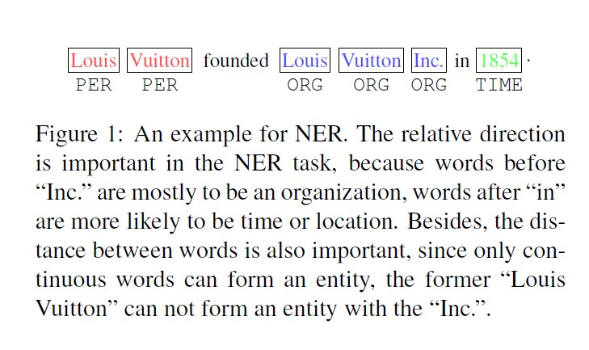

For example in Fig 1, words after “in” are more likely to be a location or time than words before it, and words before “Inc.” are mostly likely to be of the entity type “ORG”. Besides, an entity is a continuous span of words.
Therefore, the awareness of distance might help the word better recognizes its neighbor. 
To endow the Transformer with the ability of direction- and distanceawareness,
***we adopt the relative positional encoding (Shaw et al., 2018; Huang et al., 2019; Dai et al., 2019). instead of the absolute position encoding.***
We propose a revised relative positional encoding that uses fewer parameters and performs better.

首先是在普通Transformer中使用的正弦曲线位置嵌入，它对位置敏感但方向不敏感。
此外，在被普通Transformer使用的时候，这种特性会丢失。
但是，方向和距离的信息在NER任务中都很重要。
例如，举例子。in后面很可能是地点或者时间而不是单词，之前的单词inc很有可能是实体类型ORG.
此外，实体还可能是连续的单词。
因此，距离感知能够帮助一个单词更好地识别出它的近邻。
为了赋予这个trransformer方向和距离敏感的能力，我们采取了一种相对位置编码来代替绝对位置编码。
我们提出了一种改进的相对位置编码，它使用更少的参数并且表现更好。

>The second is an empirical finding. 
The attention distribution of the vanilla Transformer is scaled and smooth. 
But for NER, a sparse attention is suitable since not all words are necessary to be attended. 
Given a current word, a few contextual words are enough to judge its label. 
The smooth attention could include some noisy information.
Therefore, ***we abandon the scale factor of dot-production attention and use an un-scaled and sharp attention.***

第二点则是实验发现。
普通transformer的attention分布是有比例且平滑的。
但是对于NER人物，一个稀疏的attention分布可能会更合适，因为并不是所有单词都有必要被看到。
给出一个当前的单词，一些前后关系词，对判断它的标签而言已经足够。
平滑的attention可能会包含很多的噪声信息。
因此，我们抛弃了点产品attention的比例因此，并使用一个未缩放且锋利的attention。

>With the above improvements, we can greatly boost the performance of Transformer encoder for NER.

通过上面的改进，我们极大地提升了Transformer编码器在NER任务上的表现效果。

>Other than only using Transformer to model the word-level context, we also tried to apply it as a character encoder to model word representation with character-level information. 
The previous work has proved that character encoder is necessary to capture the character-level features and alleviate the out-of-vocabulary (OOV) problem (Lample et al., 2016;
Ma and Hovy, 2016; Chiu and Nichols, 2016; Xin et al., 2018). 
In NER, CNN is commonly used as the character encoder.
However, we argue that CNN is also not perfect for representing character-level information, 
because the receptive field of CNN is limited, and the kernel size of the CNN character encoder is usually 3, which means it cannot correctly recognize 2-gram or 4-gram patterns. 
Although we can deliberately design different kernels, ***CNN still cannot solve patterns with discontinuous characters***, such as “un..ily” in “unhappily” and “unnecessarily”.
Instead, ***the Transformer-based character encoder shall not only fully make use of the concurrence power of GPUs, but also have the potentiality to recognize different n-grams and even discontinuous patterns. ***
Therefore, in this paper, we also try to use Transformer as the character encoder, and we compare four kinds of character encoders.

**该段介绍字符编码器**

除了使用Transformer来模拟单词级别的上下文，我们同样将它应用在字符级别的特征以及缓和词汇量过大的问题。
在NER任务重，CNN通常作为字符编码器使用。
然而，我们主张CNN在代表字符级别的信息时仍然不完美，因为CNN的感受野是受限的，CNN字符编码器的内核大小通常是3，这意味着，它不能准确的识别2元或者4元模型。
尽管我们能够刻意设计出不同大小的内核，但CNN仍然不能用不连续字符解决模型问题，例如。。。。。。。。。
取而代之的是，基于transformer的字符编码器可能不仅重复利用了GPU的合并算力，同时也有识别出n元甚至是不连续模型的n元问题的潜力。
因此，在这篇文章中，我们尝试使用Transformer作为字符编码器，并且我们比较四种不同的字符编码器。

>In summary, to improve the performance of the Transformer-based model in the NER task, we explicitly utilize the directional relative positional encoding, reduce the number of parameters and sharp the attention distribution. 
After the adaptation, the performance raises a lot, making our model even performs better than BiLSTM based models. 
Furthermore, in the six NER datasets, we achieve state-of-the-art performance among models without considering the pre-trained language models or designed features.

总之，为了提高基于transformer的模型在NER任务中的表现，我们明确使用了方向相对位置编码，减少参数数量和锐化attention的分布。
在改良后，网络效果提升了很多，这使我们的模型比基于BiLSTM的模型效果好很多。
而且，在六个NER的数据集上，在没有考虑预训练语言模型和设计特征的情况下，我们取得了极好的效果。

## 1.2 Related Work

### 1.2.1 Neural Architecture for NER

>Collobert et al. (2011) utilized the Multi-Layer Perceptron (MLP) and CNN to avoid using task specific features to tackle different sequence labeling tasks, such as Chunking, Part-of-Speech (POS) and NER. 
In (Huang et al., 2015), BiLSTM-CRF was introduced to solve sequence labeling questions. Since then, the BiLSTM has been extensively used in the field of NER (Chiu and Nichols, 2016; Dong et al., 2016; Yang et al., 2018; Ma and Hovy, 2016).

C使用多层感知机和CNN来避免使用特定特征处理不同的序列标记任务，例如分块、词性分析和NER。
2015，BiLSTM-CRF被用在解决序列标记问题上，从那时起，BiLSTM已经在NER领域内被广泛应用。

>Despite BiLSTM’s great success in the NER task, it has to compute token representations one by one, which massively hinders full exploitation of GPU’s parallelism. 
Therefore, CNN has been proposed by (Strubell et al., 2017; Gui et al., 2019a) to encode words concurrently. 
In order to enlarge the receptive field of CNNs, (Strubell et al., 2017) used iterative dilated CNNs (IDCNN).

虽然BiLSTM在NER任务中取得了巨大的成功，但它需要计算一个个地计算令牌表示，这极大地拖慢了GPU的利用效率。
因此，CNN被提议同时编码单词，为了扩大CNN的感受野，S使用膨胀CNN

>Since the word shape information, such as the capitalization and n-gram, is important in recognizing named entities, 
CNN and BiLSTM have been used to extract character-level information (Chiu and Nichols, 2016; Lample et al., 2016; Ma and Hovy, 2016; Strubell et al., 2017; Chen et al., 2019).

由于词类型信息，例如n元和大写，在识别命名实体中是很重要的，CNN和BiLSTM都被用来提取字符级别的信息。

>Almost all neural-based NER models used pretrained word embeddings, like Word2vec and Glove (Pennington et al., 2014; Mikolov et al., 2013). 
And when contextual word embeddings are combined, the performance of NER models will boost a lot (Peters et al., 2017, 2018; Akbik et al., 2018). 
ELMo introduced by (Peters et al., 2018) used the CNN character encoder and BiLSTM languagemodels to get contextualized word representations.
Except for the BiLSTM based pre-trained models, BERT was based on Transformer (Devlin et al., 2018).

几乎所有基于神经元的NER模型都是用预训练的词嵌入，例如word2vec和Glove.
并且当上下文的词嵌入被结合起来，NER模型的表现会提高很多。
P介绍了Elmo，使用CNN字符编码器和BiLSTM语言模型去获得上下文相关的词表示。
除了基于BiLSTM的预训练模型，BERT也基于Transformer。

1.2.2 Transformer

>Transformer was introduced by (Vaswani et al., 2017), which was mainly based on self-attention.
It achieved great success in various NLP tasks.
Since the self-attention mechanism used in the Transformer is unaware of positions, to avoid this shortage, position embeddings were used (Vaswani et al., 2017; Devlin et al., 2018). 
Instead of using the sinusoidal position embedding (Vaswani et al., 2017) and learned absolute position embedding, 
Shaw et al. (2018) argued that the distance between two tokens should be considered when calculating their attention score. 
Huang et al. (2019) reduced the computation complexity of relative positional encoding from O(l2d) to O(ld), where l is the length of sequences and d is the hidden size. 
Dai et al. (2019) derived a new form of relative positional encodings, so that the relative relation could be better considered.

Transformer主要基于self-attention.
它在不同的自然语言处理任务中取得了较好的效果。
因为Tranformer中使用的self-attension结构对位置不知道位置，为了避免这个缺点，位置嵌入的方法被使用。
不使用正弦曲线位置嵌入和学习的绝对位置嵌入，Shaw认为，在计算它们的attention分数时，应该考虑两个符号之前的距离。
Huang将相对位置编码的计算复杂度从12到1。这里l指的是序列长度，而d是隐藏大小。
Dai得到了相对位置编码的新形式，因此相对关系可以更好地考虑。
#### 1.2.2.1 Transformer Encoder Architecture
>We first introduce the Transformer encoder proposed in (Vaswani et al., 2017). 
The Transformer encoder takes in an matrix H 2 Rld, where l is the sequence length, d is the input dimension. 
Then three learnable matrix Wq, Wk, Wv are used to project H into different spaces. 
Usually, the matrix size of the three matrix are all Rddk , where dk is a hyper-parameter. 
After that, the scaled dotproduct attention can be calculated by the following equations,

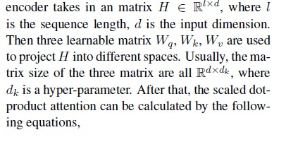

我们首先介绍Transformer编码器，这是在2017年提出的。Transformer编码器考虑了l*d维地矩阵，这里l是序列长度，d是输入维度。
然后使用三个可学习的矩阵wq,wk,wv将H映射到不同的空间。
通常，这三个矩阵的大小都是d*dk，这里dk是超参数。
之后，这个比例的点产品attention可以被下面的公式计算。

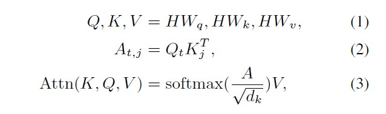

>where Qt is the query vector of the tth token, j is the token the tth token attends. 
Kj is the key vector representation of the jth token. 
The softmax is along the last dimension. 
Instead of using one group of Wq, Wk, Wv, using several groups will enhance the ability of self-attention. 
When several groups are used, it is called multi-head selfattention, the calculation can be formulated as follows,

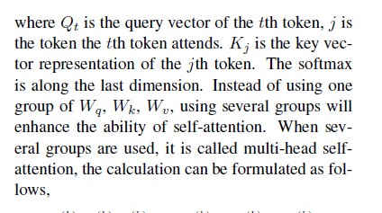

这里Qt是第t个token的查询向量，j是第t个token的伴随token。
kj是第j个token关键向量的代表。
不使用一个组的wq,wk,wv,而是使用几个组能够增强self-attention的能力。
当使用多个组时，称为多头自注意力，计算公式如下， 

>where n is the number of heads, the superscript h represents the head index. 
[head(1); :::; head(n)] means concatenation in the last dimension. 
Usually dk  n = d, which means the output of [head(1); :::; head(n)] will be of size Rld. 
Wo is a learnable parameter, which is of size Rdd.
The output of the multi-head attention will be further processed by the position-wise feedforward networks, which can be represented as follows,

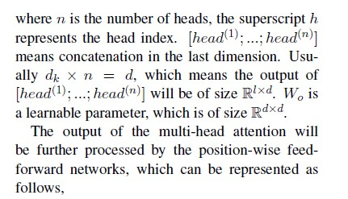

其中 n 是head的数量，上标 h 代表head索引。
[head(1); :::; head(n)] 表示最后一维的串联。
通常dk * n = d，表示[head(1); :::; head(n)] 的输出的大小为 l* d。
Wo 是一个可学习的参数，其大小为 d* d。
多头注意力的输出将被位置前馈网络进一步处理，可以表示如下， 

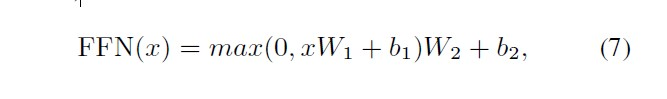

>where W1, W2, b1, b2 are learnable parameters, and W1 2 Rddff , W2 2 Rdffd, b1 2 Rdff , b2 2 Rd. dff is a hyper-parameter. 
Other components of the Transformer encoder includes layer normalization and Residual connection, we use them the same as (Vaswani et al., 2017).

Transformer 编码器的其他组件包括层归一化和残差连接，我们使用它们与 (Vaswani et al., 2017) 相同。 

#### 1.2.2.2 Position Embedding

>The self-attention is not aware of the positions of different tokens, making it unable to capture the sequential characteristic of languages. 
In order to solve this problem, (Vaswani et al., 2017) suggested to use position embeddings generated by sinusoids of varying frequency. 
The tth token’s position embedding can be represented by the following equations

自注意力不知道不同标记的位置，使其无法捕捉语言的顺序特征。
为了解决这个问题，(Vaswani et al., 2017) 建议使用由不同频率的正弦曲线生成的位置嵌入。
第 t 个令牌的位置嵌入可以由以下等式表示 

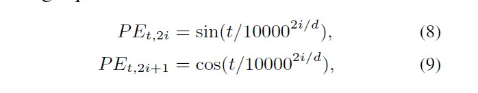

> where i is in the range of [0; d 2 ], d is the input dimension.
> This sinusoid based position embedding makes Transformer have an ability to model the position of a token and the distance of each two tokens.
> For any fixed offset k, PEt+k can be represented by a linear transformation of PEt (Vaswani et al., 2017).

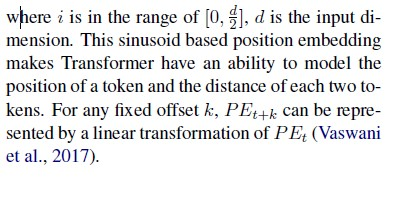

其中 i 在 [0; d /2 ]，d 是输入维度。
这种基于正弦曲线的位置嵌入使 Transformer 能够对标记的位置和每两个标记的距离进行建模。
对于任何固定偏移量 k，PEt+k 可以用 PEt 的线性变换表示（Vaswani 等，2017）。 

## 1.3 Proposed Model

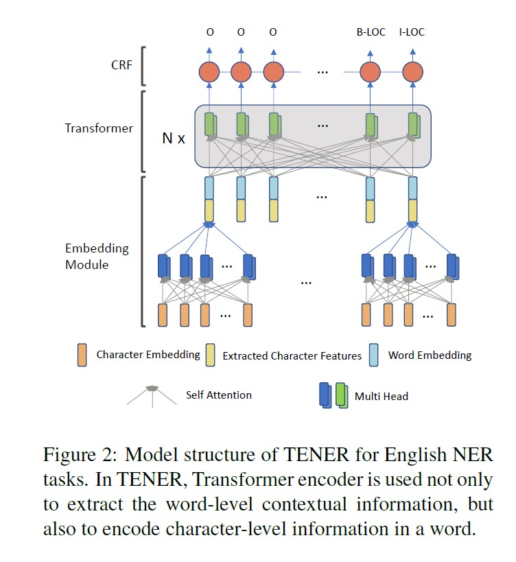

>In this paper, we utilize the Transformer encoder to model the long-range and complicated interactions of sentence for NER. 
The structure of proposed model is shown in Fig 2. 
We detail each parts in the following sections.

在本文中，我们利用 Transformer 编码器为 NER 对句子的长范围和复杂交互进行建模。
所提出模型的结构如图2所示。
我们将在以下部分详细介绍每个部分。 

### 1.3.1 Embedding Layer

>To alleviate the problems of data sparsity and out-of-vocabulary (OOV), most NER models adopted the CNN character encoder (Ma and Hovy, 2016; Ye and Ling, 2018; Chen et al., 2019) to represent words. 
Compared to BiLSTM based character encoder (Lample et al., 2016; Ghaddar and Langlais, 2018), CNN is more efficient. 
Since Transformer can also fully exploit the GPU’s parallelism, it is interesting to use Transformer as the character encoder.
A potential benefit of Transformer-based character encoder is to extract different n-grams and even uncontinuous character patterns, like “un..ily” in “unhappily” and “uneasily”. 
For the model’s uniformity, we use the “adapted Transformer” to represent the Transformer introduced in next subsection.
The final word embedding is the concatenation of the character features extracted by the character encoder and the pre-trained word embeddings.

为了缓解数据稀疏和词汇量不足 (OOV) 的问题，大多数 NER 模型采用 CNN 字符编码器（Ma and Hovy，2016；Ye 和 Ling，2018；Chen 等，2019）来表示单词。
与基于 BiLSTM 的字符编码器（Lample 等人，2016 年；Ghaddar 和 Langlais，2018 年）相比，CNN 的效率更高。
由于 Transformer 也可以充分利用 GPU 的并行性，因此使用 Transformer 作为字符编码器很有趣。
基于 Transformer 的字符编码器的一个潜在好处是提取不同的 n-gram 甚至不连续的字符模式，例如“unhappyly”和“uneasily”中的“un..ily”。
为了模型的一致性，我们使用“adapted Transformer”来表示下一小节介绍的Transformer。
最终的词嵌入是字符编码器提取的字符特征和预训练词嵌入的串联。 

### 1.3.2 Encoding Layer with Adapted Transformer

>Although Transformer encoder has potential advantage in modeling long-range context, it is not working well for NER task. In this paper, we propose an adapted Transformer for NER task with two improvements.

尽管 Transformer 编码器在建模远程上下文方面具有潜在优势，但它不适用于 NER 任务。 在本文中，我们为 NER 任务提出了一种适用的 Transformer，有两个改进。 

#### 1.3.2.1 Direction and Distance Aware Tranformer

>Inspired by the success of BiLSTM in NER tasks, we consider what properties the Transformer lacks compared to BiLSTM-based models. 
One observation is that BiLSTM can discriminatively collect the context information of a token from its left and right sides. 
But it is not easy for the Transformer to distinguish which side the context information comes from.
Although the dot product between two sinusoidal position embeddings is able to reflect their distance, it lacks directionality and this property will be broken by the vanilla Transformer attention.
To illustrate this, we first prove two properties of the sinusoidal position embeddings.

受 BiLSTM 在 NER 任务中取得成功的启发，我们考虑了 Transformer 与基于 BiLSTM 的模型相比缺少哪些属性。
一个观察结果是 BiLSTM 可以从其左侧和右侧有区别地收集令牌的上下文信息。
但是 Transformer 很难区分上下文信息来自哪一边。
尽管两个正弦位置嵌入之间的点积能够反映它们的距离，但它缺乏方向性，并且这种特性将被普通的 Transformer 注意力破坏。
为了说明这一点，我们首先证明了正弦位置嵌入的两个属性。 

**属性1**

证明

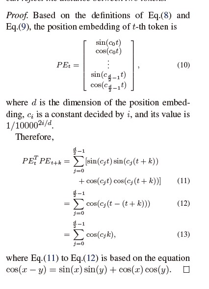

这两个正弦位置嵌入的点积可以反映两个token之间的距离。 

**属性2**

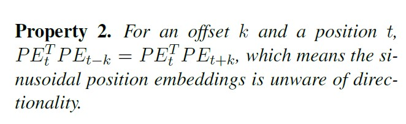

证明

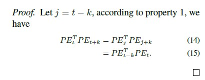

> The relation between d, k and PET t PEt+k is displayed in Fig 3. 

> The sinusoidal position embeddings are distance-aware but lacks directionality.
> However, the property of distance-awareness also disappears when PEt is projected into the query and key space of self-attention. 

> Since in vanilla Transformer the calculation between PEt and PEt+k is actually PET t WT q WkPEt+k, where Wq;Wk are parameters in Eq.(1). Mathematically, it can be viewed as PET t WPEt+k with only one parameter W. 

> The relation between PET t PEt+k and PETt WPEt+k is depicted in Fig 4.Therefore, to improve the Transformer with direction- and distance-aware characteristic, wecalculate the attention scores using the equations below:

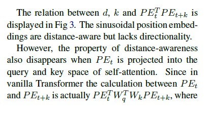

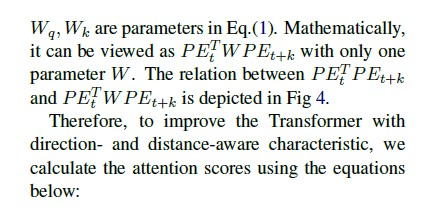

d、k与PET的关系t PEt+k 是显示在图 3. 

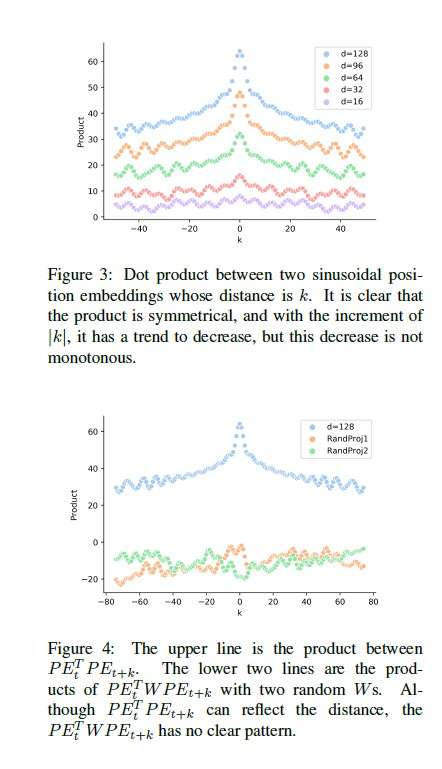

正弦位置嵌入有距离意识但缺乏方向性。然而，距离感知的特性当 PEt 投射到自注意力的查询和关键空间。 自从在
vanilla Transformer PEt 之间的计算而 PEt+k 实际上是 PET重量q WkPEt+k，其中Wq;Wk 是等式（1）中的参数。 在数学上，它可以被视为PETt WPEt+k 只有一个参数W.PET之间的关系t PEt+k和 PETt WPEt+k 如图 4 所示。因此，要改进 Transformer方向和距离感知特性，我们使用方程计算注意力分数
以下.

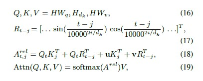

> where t is index of the target token, j is the index of the context token, Qt;Kj is the query vector and key vector of token t; j respectively, Wq;Wv 2 Rddk .
>
> To get Hdk 2 Rldk , we first split H into d=dk partitions in the second dimension, then for each head we use one partition. u 2 Rdk , v 2 Rdk are learnable parameters, Rt􀀀j is the relative positional encoding, and Rt􀀀j 2 Rdk , i in Eq.(17) is in the range [0; dk 2 ]. QTt Kj in Eq.(18) is the attention score between two tokens; 
>
> QTt Rt􀀀j is the tth token’s bias on certain relative distance; uTKj is the bias on the jth token; vTRt􀀀j is the bias term for certain distance and direction.

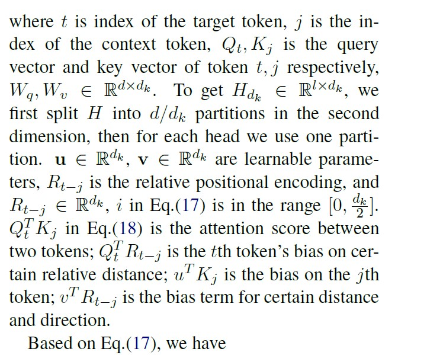

其中 t 是目标标记的索引，j 是索引 上下文标记的 Qt;Kj 是查询 token t的向量和关键向量； j 分别， Wq;Wv 2 Rd dk 。 为了得到 Hdk 2 Rl dk ，我们 在第二个中首先将 H 拆分为 d=dk 分区 维度，然后对于每个头部我们使用一个分区。
u 2 Rdk , v 2 Rdk 是可学习的参数， Rt􀀀j 是相对位置编码，并且 等式(17)中的Rt􀀀j 2 Rdk , i 在[0; dk 2]。
QTt 等式（18）中的 Kj 是 两个令牌； QTt Rt􀀀j 是第 t 个令牌对某些 相对距离； uTKj 是第 j 个的偏差 令牌； vTRt􀀀j  特定距离的偏置项和方向。

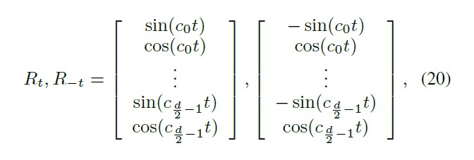

> because sin(􀀀x) = 􀀀sin(x); cos(x) = cos(􀀀x).
> This means for an offset t, the forward and backward relative positional encoding are the same with respect to the cos(cit) terms, but is the opposite with respect to the sin(cit) terms. 
>
> Therefore, by using Rt􀀀j , the attention score can distinguish different directions and distances.
>
> 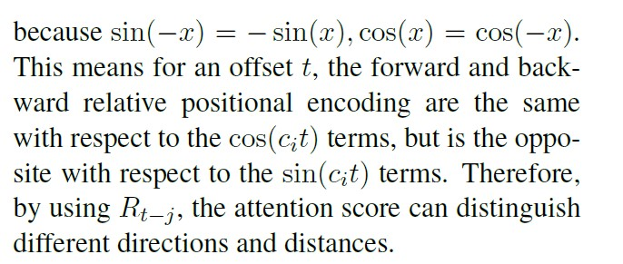
>
> The above improvement is based on the work (Shaw et al., 2018; Dai et al., 2019). Since the size of NER datasets is usually small, we avoid direct multiplication of two learnable parameters, because they can be represented by one learnable parameter. 
>
> Therefore we do not useWk in Eq.(16). The multi-head version is the same as Eq.(6), but we discardWo since it is directly multiplied byW1 in Eq.(7).

因为 sin(x) = sin(x); cos(x) = cos(􀀀x)。 这意味着对于偏移量 t，向前和向后 相对位置编码相同 关于 cos(cit) 项，但相反 关于 sin(cit) 项。 所以， 通过使用 Rt􀀀j ，attention score 可以区分不同的方向和距离。以上改进是基于工作（Shaw 等人，2018 年；Dai 等人，2019 年）。 自从NER 数据集的大小通常很小，我们避免两个可学习参数的直接乘法，因为它们可以用一个可学习的来表示范围。 因此我们在方程（16）中不使用 Wk。多头版本与等式（6）相同，但我们丢弃Wo，因为它直接乘以W1在等式（7）中。

#### 1.3.2.2 Unscaled and Dot-Product Attention

> The vanilla Transformer use the scaled dotproduct attention to smooth the output of softmax function. 
>
> In Eq.(3), the dot product of key and value matrices is divided by the scaling factor p dk.
>
> We empirically found that models perform better without the scaling factor pg根号下 dk. 
>
> We presume this is because without the scaling factor the attention will be sharper.
>
>  And the sharper attention might be beneficial in the NER task since only few words in the sentence are named entities.

vanilla Transformer 使用缩放的点积注意力来平滑 softmax 函数的输出。在等式（3）中，键矩阵和值矩阵的点积除以缩放因子 p dk 。我们凭经验发现模型在没有比例因子 pg 根号下 dk 的情况下表现更好。我们假设这是因为没有比例因子，注意力会更敏锐。更敏锐的注意力可能有利于 NER 任务，因为句子中只有少数单词是命名实体。

### 1.3.3 CRF Layer

> In order to take advantage of dependency between different tags, the Conditional Random Field (CRF) was used in all of our models. 
>
> Given a sequence s = [s1; s2; :::; sT ], the corresponding golden label sequence is y = [y1; y2; :::; yT ], and Y(s) represents all valid label sequences. 
>
> The probability of y is calculated by the following equation

为了利用不同标签之间的依赖性，我们在所有模型中都使用了条件随机场 (CRF)。给定一个序列 s = [s1; s2; :::; sT ]，对应的金标序列为 y = [y1; y2; :::; yT ]，Y(s) 代表所有有效的标签序列。y 的概率由以下等式计算。

> where f(yt􀀀1; yt; s) computes the transition score from yt􀀀1 to yt and the score for yt. 
>
> The optimization target is to maximize P(yjs). 
>
> When decoding,the Viterbi Algorithm is used to find the path achieves the maximum probability.

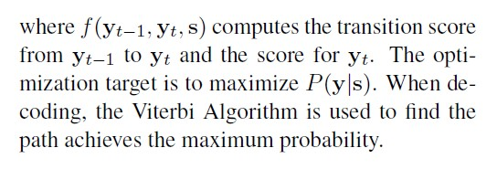

其中 f(yt1; yt; s) 计算从 yt1 到 yt 的转换分数以及 yt 的分数。优化目标是最大化 P(yjs)。解码时采用维特比算法寻找路径达到最大概率。

## 1.4 Experiment

### 1.4.1 Data

> We evaluate our model in two English NER datasets and four Chinese NER datasets.
(1) CoNLL2003 is one of the most evaluated English NER datasets, which contains four different named entities: 
PERSON, LOCATION, ORGANIZATION, and MISC (Sang and Meulder, 2003).
(2) OntoNotes 5.0 is an English NER dataset whose corpus comes from different domains, such as telephone conversation, newswire.
We exclude the New Testaments portion since there is no named entity in it (Chen et al., 2019; Chiu and Nichols, 2016). 
This dataset has eleven entity names and seven value types, like CARDINAL, MONEY, LOC.
(3) Weischedel (2011) released OntoNotes 4.0. 
In this paper, we use the Chinese part. We adopted the same pre-process as (Che et al., 2013).
(4) The corpus of the Chinese NER dataset MSRA came from news domain (Levow, 2006).
(5) Weibo NER was built based on text in Chinese social media Sina Weibo (Peng and Dredze, 2015), and it contained 4 kinds of entities.
(6) Resume NER was annotated by (Zhang and Yang, 2018).

我们在两个英文 NER 数据集和四个中文 NER 数据集上评估我们的模型。
(1) CoNLL2003 是评价最高的英语 NER 数据集之一，它包含四个不同的命名实体：
人、位置、组织和其他（Sang 和 Meulder，2003 年）。
(2) OntoNotes 5.0是英文NER数据集，其语料来自不同领域，如电话交谈、新闻专线等。
我们排除了New Testaments部分，因为其中没有命名实体（Chen 等，2019；Chiu 和 Nichols，2016）。
该数据集有 11 个实体名称和 7 个值类型，如 CARDINAL、MONEY、LOC。
(3) Weischedel (2011) 发布 OntoNotes 4.0。
在本文中，我们使用中文部分。我们采用了与 (Che et al., 2013) 相同的预处理。
(4) 中文 NER 数据集 MSRA 的语料库来自新闻领域 (Levow, 2006)。
(5) 微博NER是基于中国社交媒体新浪微博(Peng and Dredze, 2015)中的文本构建的，它包含4种实体。
(6) Resume NER 由 (Zhang and Yang, 2018) 注释。

>Their statistics are listed in Table 1. 
For all datasets, we replace all digits with “0”, and use the BIOES tag schema. 
For English, we use the Glove 100d pre-trained embedding (Pennington et al., 2014). 
For the character encoder, we use 30d randomly initialized character embeddings. 
More details on models’ hyper-parameters can be found in the supplementary material. 
For Chinese, we used the character embedding and bigram embedding released by (Zhang and Yang, 2018). 
All pretrained embeddings are finetuned during training.
In order to reduce the impact of randomness, we ran all of our experiments at least three times, and its average F1 score and standard deviation are reported.

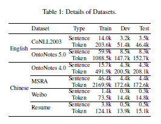

他们的统计数据如表 1 所示。
对于所有数据集，我们将所有数字替换为“0”，并使用 BIOES 标记模式。
对于英语，我们使用 Glove 100d 预训练嵌入 (Pennington et al., 2014)。
对于字符编码器，我们使用 30d 随机初始化的字符嵌入。
有关模型超参数的更多详细信息，请参见补充材料。
对于中文，我们使用了 (Zhang and Yang, 2018) 发布的字符嵌入和二元嵌入。
所有预训练的嵌入都在训练期间进行了微调。
为了减少随机性的影响，我们将所有实验至少运行了 3 次，并报告了其平均 F1 分数和标准偏差。

>We used random-search to find the optimal hyper-parameters, hyper-parameters and their ranges are displayed in the supplemental material.
We use SGD and 0.9 momentum to optimize the model. 
We run 100 epochs and each batch has 16 samples. 
During the optimization, we use the triangle learning rate (Smith, 2017) where the learning rate rises to the pre-set learning rate at the first 1% steps and decreases to 0 in the left 99% steps. 
The model achieves the highest development performance was used to evaluate the test set. 
The hyper-parameter search range and other settings can be found in the supplementary material.
Codes are available at https://github.com/fastnlp/TENER.

我们使用随机搜索来找到最佳超参数，超参数及其范围显示在补充材料中。
我们使用 SGD 和 0.9 动量来优化模型。
我们运行了 100 个 epoch，每个批次有 16 个样本。
在优化过程中，我们使用三角形学习率 (Smith, 2017)，其中学习率在前 1% 步上升到预设学习率，并在左侧 99% 步中下降到 0。
该模型实现了最高的开发性能，用于评估测试集。
超参数搜索范围和其他设置可以在补充材料中找到。
代码可在 https://github.com/fastnlp/TENER 获得。

### 1.4.2 Results in Chinese NER datasets

>We first present our results in the four Chinese NER datasets. 
Since Chinese NER is directly based on the characters, it is more straightforward to show the abilities of different models without considering the influence of word representation.
我们首先在四个中文 NER 数据集中展示我们的结果。
由于中文 NER 直接基于字符，因此在不考虑词表示的影响的情况下，可以更直接地展示不同模型的能力。 

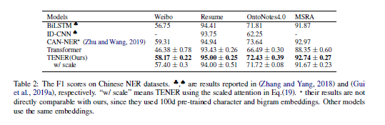

>As shown in Table 2, the vanilla Transformer does not perform well and is worse than the BiLSTM and CNN based models. However, when relative positional encoding combined, the performance was enhanced greatly, resulting in better results than the BiLSTM and CNN in all datasets.
The number of training examples of the Weibo dataset is tiny, therefore the performance of the Transformer is abysmal, which is as expected since the Transformer is data-hungry. 
Nevertheless, when enhanced with the relative positional encoding and unscaled attention, it can achieve even better performance than the BiLSTM-based model. 
The superior performance of the adapted Transformer in four datasets ranging from small datasets to big datasets depicts that the adapted Transformer is more robust to the number of training examples than the vanilla Transformer. 
As the last line of Table 2 depicts, the scaled attention will deteriorate the performance.

如表 2 所示，vanilla Transformer 表现不佳，并且比基于 BiLSTM 和 CNN 的模型差。 然而，当相对位置编码相结合时，性能得到了极大的提升，在所有数据集上都取得了比 BiLSTM 和 CNN 更好的结果。
微博数据集的训练样本数量很少，因此 Transformer 的性能非常糟糕，这符合预期，因为 Transformer 需要大量数据。
尽管如此，当使用相对位置编码和未缩放的注意力进行增强时，它可以获得比基于 BiLSTM 的模型更好的性能。
适配 Transformer 在从小数据集到大数据集的四个数据集中的卓越性能表明适配 Transformer 对训练示例的数量比 vanilla Transformer 更稳健。
正如表 2 的最后一行所描述的，缩放注意力会降低性能。 

### 1.4.3 Results in English NER datasets

>The comparison between different NER models on English NER datasets is shown in Table 3.

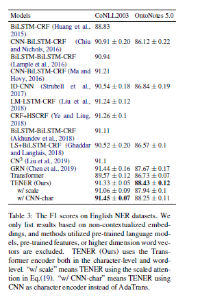

>The poor performance of the Transformer in the NER datasets was also reported by (Guo et al., 2019). 
Although performance of the Transformer is higher than (Guo et al., 2019), it still lags behind the BiLSTM-based models (Ma and Hovy, 2016). 
Nonetheless, the performance is massively enhanced by incorporating the relative positional encoding and unscaled attention into the Transformer.
The adaptation not only makes the Transformer achieve superior performance than BiLModels STM based models, 
but also unveil the new state-of-the-art performance in two NER datasets when only the Glove 100d embedding and CNN character embedding are used. 
The same deterioration of performance was observed when using the scaled attention. 
Besides, if ELMo was used (Peters et al., 2018), the performance of TENER can be further boosted as depicted in Table 4.

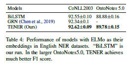

不同NER模型在英语NER数据集上的比较如表3所示。
(Guo et al., 2019) 也报告了 Transformer 在 NER 数据集中的糟糕表现。
尽管 Transformer 的性能高于（Guo 等人，2019），但仍落后于基于 BiLSTM 的模型（Ma 和 Hovy，2016 年）。
尽管如此，通过将相对位置编码和未缩放的注意力整合到 Transformer 中，性能得到了极大的提高。
适配不仅使 Transformer 实现了优于 BiLModels STM 模型的性能，
当仅使用 Glove 100d 嵌入和 CNN 字符嵌入时，还会在两个 NER 数据集中展示新的最先进性能。
使用缩放注意力时，也观察到了同样的性能下降。
此外，如果使用 ELMo（Peters 等，2018），TENER 的性能可以进一步提升，如表 4 所示。
### 1.4.4 Analysis of Different Character Encoder

>The character-level encoder has been widely used in the English NER task to alleviate the data sparsity and OOV problem in word representation. 
In this section, we cross different character-level encoders (BiLSTM, CNN, Transformer encoder and our adapted Transformer encoder (AdaTrans for short)) and different word-level encoders (BiLSTM, ID-CNN and AdaTrans) to implement the NER task. 
Results on CoNLL2003 and OntoNotes 5.0 are presented in Table 5a and Table 5b, respectively.
The ID-CNN encoder is from (Strubell et al., 2017), and we re-implement their model in Py-Torch. 
For different combinations, we use random search to find its best hyper-parameters. 
Hyperparameters for character encoders were fixed. 
The details can be found in the supplementary material.
For the results on CoNLL2003 dataset which is depicted in Table 5a, the AdaTrans performs as good as the BiLSTM in different character encoder scenario averagely. 
In addition, from Table 5b, we can find the pattern that the AdaTrans character encoder outpaces the BiLSTM and CNN character encoders when different word-level encoders being used. 
Moreover, no matter what character encoder being used or none being used, the AdaTrans word-level encoder gets the best performance. 
This implies that when the number of training examples increases, the AdaTrans character-level and word-level encoder can better realize their ability.

字符级编码器已广泛用于英语 NER 任务中，以缓解单词表示中的数据稀疏性和 OOV 问题。
在本节中，我们跨越不同的字符级编码器（BiLSTM、CNN、Transformer 编码器和我们适配的 Transformer 编码器（简称 AdaTrans））和不同的词级编码器（BiLSTM、ID-CNN 和 AdaTrans）来实现 NER 任务。
CoNLL2003 和 OntoNotes 5.0 的结果分别列于表 5a 和表 5b 中。
ID-CNN 编码器来自 (Strubell et al., 2017)，我们在 Py-Torch 中重新实现了他们的模型。
对于不同的组合，我们使用随机搜索来找到其最佳超参数。
字符编码器的超参数是固定的。
详细信息可以在补充材料中找到。
对于表 5a 中描述的 CoNLL2003 数据集的结果，AdaTrans 在不同字符编码器场景中的平均表现与 BiLSTM 一样好。
此外，从表 5b 中，我们可以发现当使用不同的词级编码器时，AdaTrans 字符编码器超过 BiLSTM 和 CNN 字符编码器的模式。
此外，无论使用何种字符编码器或不使用何种字符编码器，AdaTrans 字级编码器都能获得最佳性能。
这意味着当训练样例数量增加时，AdaTrans 字符级和词级编码器可以更好地发挥其能力。 

### 1.4.5 Convergent Speed Comparison

We compare the convergent speed of BiLSTM, ID-CNN, Transformer, and TENER in the development set of the OntoNotes 5.0. 
The curves areshown in Fig 5. 
TENER converges as fast as the BiLSTM model and outperforms the vanilla Transformer.

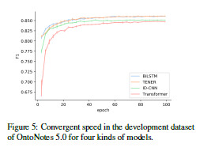

我们比较了 OntoNotes 5.0 的开发集中 BiLSTM、ID-CNN、Transformer 和 TENER 的收敛速度。
曲线如图 5 所示。
TENER 的收敛速度与 BiLSTM 模型一样快，并且优于 vanilla Transformer。

## 1.5 Conclusion

> In this paper, we propose TENER, a model adopting Transformer Encoder with specific customizations for the NER task. 
Transformer Encoder has a powerful ability to capture the long-range context.
In order to make the Transformer more suitable to the NER task, we introduce the direction-aware, distance-aware and un-scaled attention. 
Experiments in two English NER tasks and four Chinese NER tasks show that the performance can be massively increased. 
Under the same pretrained embeddings and external knowledge, our proposed modification outperforms previous models in the six datasets. 
Meanwhile, we also found the adapted Transformer is suitable for being used as the English character encoder, because it has the potentiality to extract intricate patterns from characters. 
Experiments in two English NER datasets show that the adapted Transformer character encoder performs better than BiLSTM and CNN character encoders.

在本文中，我们提出了 TENER，这是一种采用 Transformer Encoder 的模型，具有针对 NER 任务的特定定制。
Transformer Encoder 具有强大的捕获场范围上下文的能力。
为了使 Transformer 更适合 NER 任务，我们引入了方向感知、距离感知和非缩放注意力。
在两个英文 NER 任务和四个中文 NER 任务中的实验表明，性能可以大幅提升。
在相同的预训练嵌入和外部知识下，我们提出的修改在六个数据集中优于以前的模型。
同时，我们还发现适配后的 Transformer 适合用作英文字符编码器，因为它具有从字符中提取复杂模式的潜力。
在两个英文 NER 数据集中的实验表明，适配后的 Transformer 字符编码器的性能优于 BiLSTM 和 CNN 字符编码器。 

# 2. important things

### 2.1

提出了两点改进

1. 相对位置编码的transformer
2. 通过实验发现得到稀疏且锐利的attention更好用。

同时改进了字符编码器。

### 2.2 问题

1. N-gram的含义是什么？

2. BiLSTM具体的结构是什么？

   略

3. Transformer的结构是什么？

   另开

4. attention注意力机制？

   另开

5. Encoder Decoder框架？

6. 每个公式的含义？

7. CRF的内容？
