# 1. 位置编码

## 1.1 TRM: 从输入到输出

- 编码器解码器结构，从左至右。
- Encoder的结构相同，Decoder的结构相同。结构相同但参数不同。
- 循环结构。

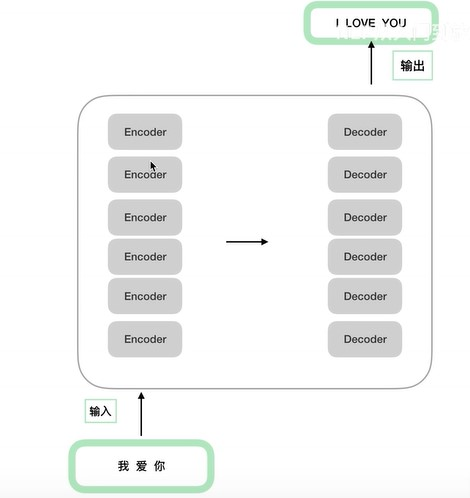

## 1.2 原论文结构

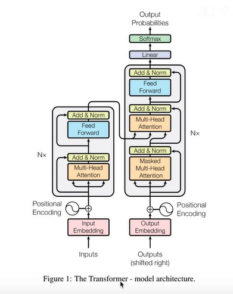

## 1.3 位置编码

### 结构解释

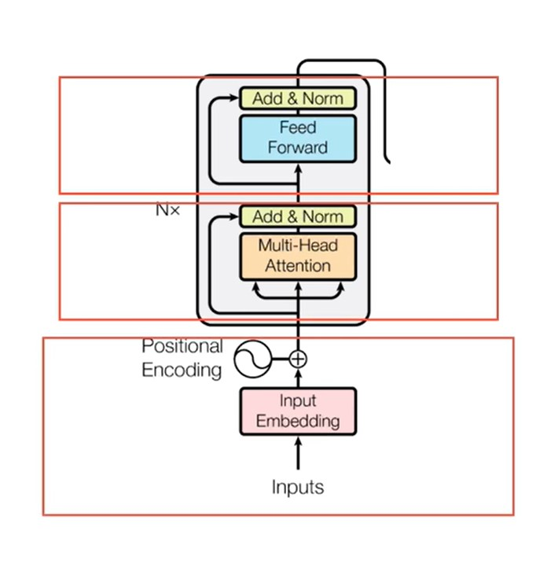

- 自下而上依次是输入部分，注意力机制，前馈神经网络

- 输入部分分为 Embedding和位置编码

- RNN共享一套参数。天然的时序关系。

  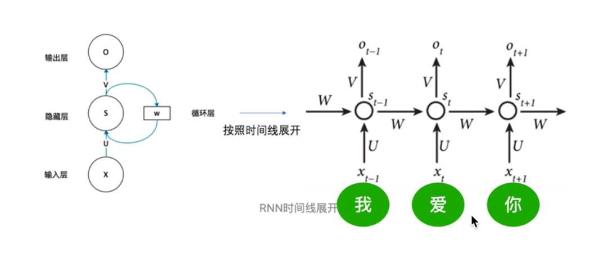

- RNN的梯度消失与普通的梯度消失的不同？

  总梯度被近距离梯度主导，被远距离梯度忽略不计。

- transformer同时把句子中的单词输入进去，增快了速度，但忽略了序列关系。相比RNN，缺少了某些东西告诉网络句子中单词的前后关系，这时需要位置编码。

  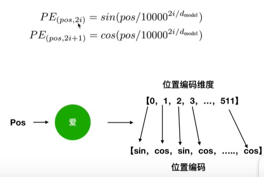

- 位置嵌入

  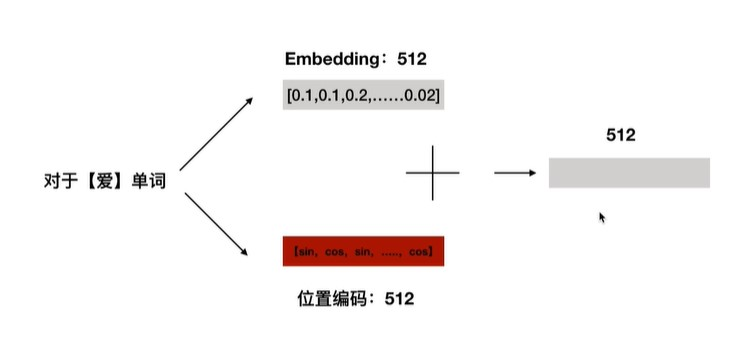

- 解释

  绝对位置向量中，蕴含了相对位置向量的信息。

  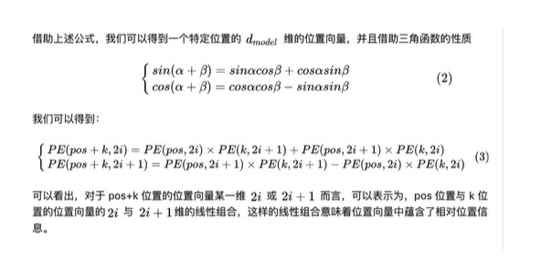

  但相对位置信息会在注意力机制那里消失。

# 2.多头注意力机制

## 2.1 基本的注意力机制

### 注意力公式

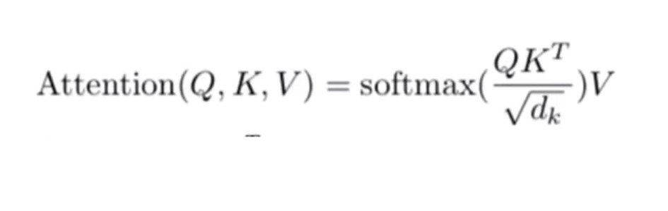

Q,K,V三个向量，QK做转置乘积，再除以一个数，并进行softmax归一化处理，再乘以V，相当于做了加权和。

- 为什么做点乘？

  点乘是一个向量在另一个向量上的投影长度，可以显示两个向量的相似程度，两个向量越相似，它的结果越大。

  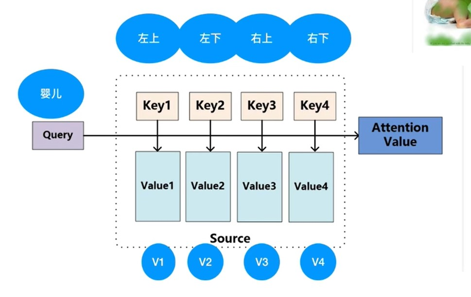

- attention在nlp中

  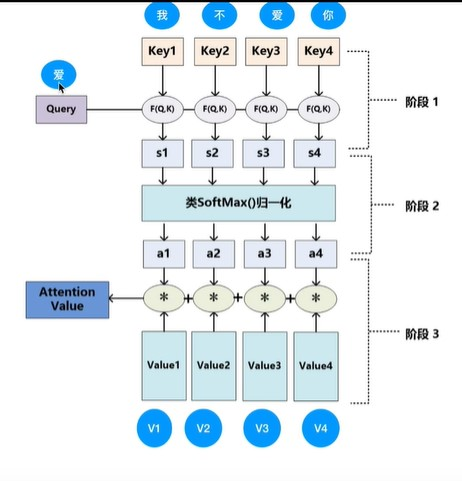

  F函数有三种形式：cos，点乘，mlp。s是点乘的结果。a是相似度结果，相加为1。相乘再相加得到最后的attention value。

## 2.2 在TRM中怎么操作

在只有单词向量的情况下，如何获取QKV三个向量。

- 首先使用三个W矩阵，训练得到。

  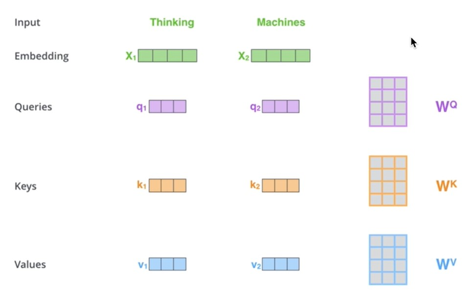

- 具体计算过程。

  下面除以8的原因是，QK乘积值很大，梯度很小，主要是为了控制方差为1。

  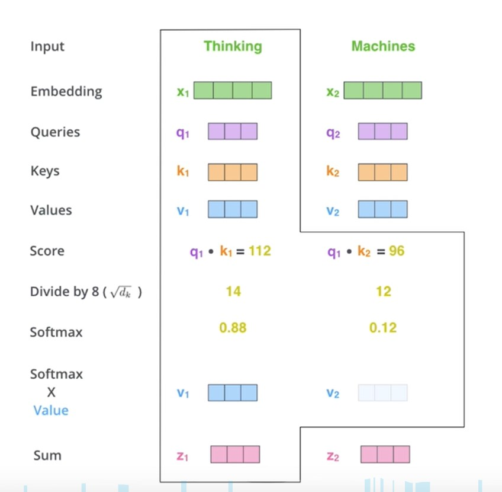

- 实际代码中使用矩阵，方便并行。

- 使用多套QKV，实验中效果确实很好，多头相当于把原始信息打到多个空间，保证transformer能够注意到不同子空间的信息。

  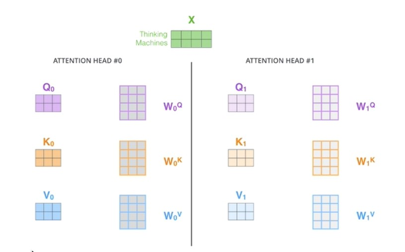

- 多个头合在一起输出。

  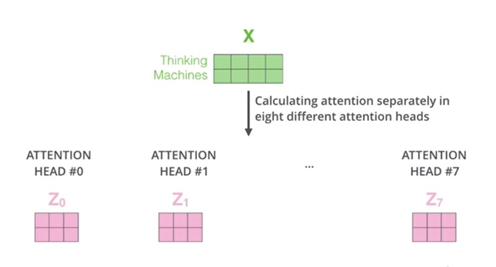

# 3. 残差和layerNorm

# 4. 前馈神经网络

# 5. TRM面试题讲解

