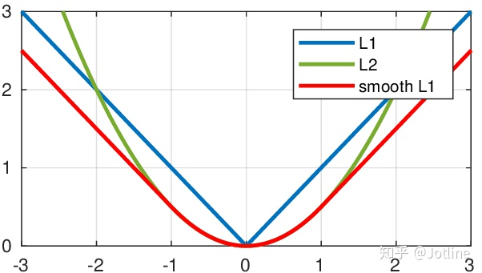
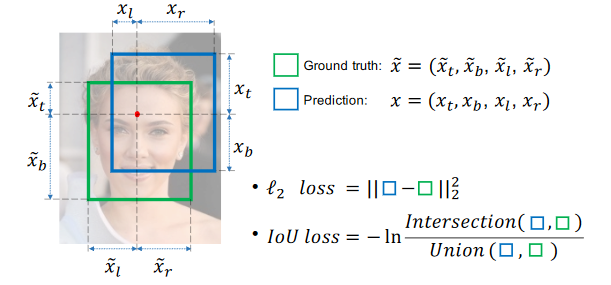
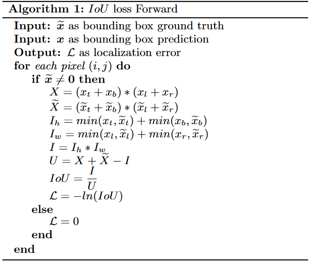
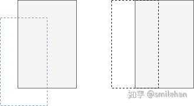
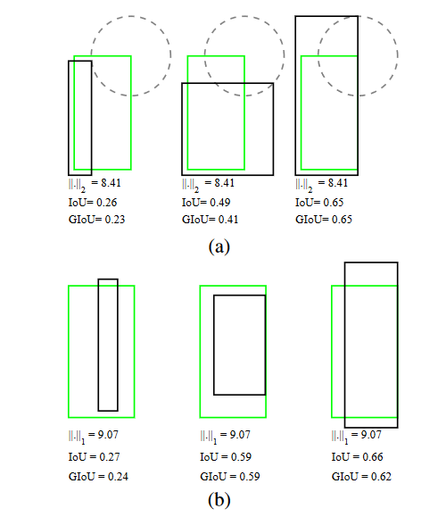
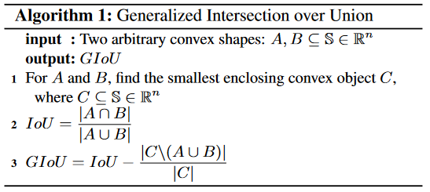
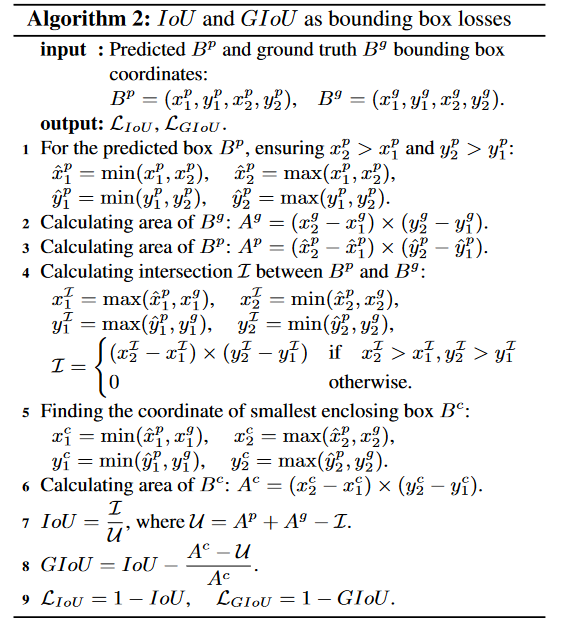
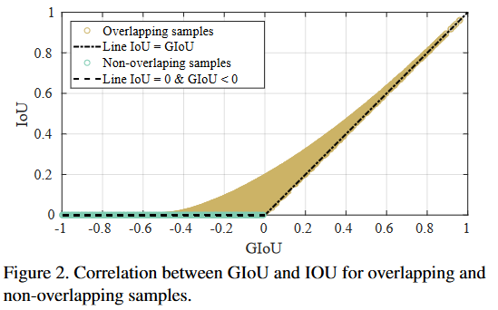
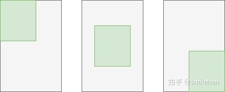

# 0.目标检测loss简述

# 1.分类loss
## 1.1交叉熵损失CE

## 1.2 focal loss
### motivation
在one-stage检测算法中，会出现正负样本数量不平衡以及难易样本数量不平衡的情况，为了解决则以问题提出了focal loss。

hit的检测框就是正样本。容易的正样本是指置信度高且hit的检测框，困难的负样本就是置信度低但hit的检测框，容易的负样本是指未hit且置信度低的检测框，困难的负样本指未hit但置信度高的检测框。
### solution
目的是解决样本数量不平衡的情况 - 正样本loss增加，负样本loss减小 - 难样本loss增加，简单样本loss减小

# 2.回归loss

## 2.1 L1 loss
$$
loss(x,y) = \frac{1}{n} \sum_{i=1}^{n} \rvert y_i - f(x_i)\rvert
$$
- l1 loss在零点不平滑，用的较少。一般来说，l1正则会制造稀疏的特征，大部分无用的特征的权重会被置为0。

- （适合回归任务，简单的模型，由于神经网络通常解决复杂问题，很少使用。）

- L1 loss的鲁棒性(抗干扰性)比L2 loss强。概括起来就是L1对异常点不太敏感，而L2则会对异常点存在放大效果。因为L2将误差平方化，当误差大于1时，误会会放大很多，所以使用L2 loss的模型的误差会比使用L1 loss的模型对异常点更敏感。如果这个样本是一个异常值，模型就需要调整以适应单个的异常值，这会牺牲许多其它正常的样本，因为这些正常样本的误差比这单个的异常值的误差小。如果异常值对研究很重要，最小均方误差则是更好的选择。

- L1 loss 对 x(损失值)的导数为常数，在训练后期，x较小时，若学习率不变，损失函数会在稳定值附近波动，很难收敛到更高的精度。

- L2 loss的稳定性比L1 loss好。概括起来就是对于新数据的调整，L1的变动很大，而L2的则整体变动不大。

### L1不可导？
当损失函数不可导,梯度下降不再有效,可以使用坐标轴下降法。
梯度下降是沿着当前点的负梯度方向进行参数更新；
而坐标轴下降法是沿着坐标轴的方向；
假设有m个特征个数,坐标轴下降法进行参数更新的时候,先固定m-1个值,然后再求另外一个的局部最优解,从而避免损失函数不可导问题。

使用Proximal Algorithm对L1进行求解,此方法是去优化损失函数上界结果。

## 2.2 L2 loss
$$
loss(x,y) = \frac{1}{n}\sum_{i=1}^{n}(y_i-f(x_i))^2
$$
- 对离群点比较敏感，如果feature是unbounded的话，需要好好调整学习率，防止出现梯度爆炸的情况。l2正则会让特征的权重不过大，使得特征的权重比较平均。

- （适合回归任务，数值特征不大，问题维度不高）

- 从L2 loss的图像可以看到，图像(上图左边红线)的每一点的导数都不一样的，离最低点越远，梯度越大，使用梯度下降法求解的时候梯度很大，可能导致梯度爆炸。

- L1 loss一般用于简单的模型，但由于神经网络一般是解决复杂的问题，所以很少用L1 loss，例如对于CNN网络，一般使用的是L2-loss，因为L2-loss的收敛速度比L1-loss要快。如下图：

## 2.3 Smooth L1 loss
$$
loss(x,y)=\frac{1}{n}\sum_{i=1}^n 
\begin{cases}
0.5 * (y_i-f(x_i))^2, & if\rvert y_i-f(x_i)\rvert <1 \\
\lvert y_i-f(x_i) \rvert - 0.5, & otherwise
\end{cases}
$$
- 修改零点不平滑问题，L1-smooth比l2 loss对异常值的鲁棒性更强。具有l1和l2的优点，当绝对差值小于1，梯度不至于太大，损失函数较平滑，当差别大的时候，梯度值足够小，较稳定，不容易梯度爆炸。

- （回归，当特征中有较大的数值，适合大多数问题）

- 当预测值和ground truth差别较小的时候（绝对值差小于1），其实使用的是L2 Loss，当绝对值差小于1时，由于L2会对误差进行平方，因此会得到更小的损失，有利于模型收敛。而当差别大的时候，是L1 Loss的平移，因此相比于L2损失函数，其对离群点（指的是距离中心较远的点）、异常值（outlier）不敏感，可控制梯度的量级使训练时不容易跑飞。。SooothL1Loss其实是L2Loss和L1Loss的结合，它同时拥有L2 Loss和L1 Loss的部分优点。

**Smooth L1**

当预测框与 ground truth 差别过大时，梯度值不至于过大；
当预测框与 ground truth 差别很小时，梯度值足够小。

应用在目标检测中，位置损失为：
$$
L_{loc}(t^u,v)=\sum_{i\in\lbrace x,y,w,h\rbrace} smooth_{L_1}(t_i^u-v_i)
 $$
其中$v=(v_x,v_y,v_w,v_h)$表示bbox的真实值，$t^u=(t_x^u,t_y^u,t_w^u,t_h^u)$表示bbox的预测值

### 缺点
L1/L2/smooth l1 在计算目标检测的 bbox loss时，都是独立的求出4个点的 loss，然后相加得到最终的 bbox loss。这种做法的默认4个点是相互独立的，与实际不符。举个例子，当(x, y)为右下角时，w h其实只能取0;目标检测的评价 bbox 的指标是 IoU，IoU 与smooth L1 loss 的变化不匹配
## 2.4 IOU loss

### 简述

Yu, J., Jiang, Y., Wang, Z., Cao, Z., Huang, T., 2016. UnitBox: An Advanced Object Detection Network, in: Proceedings of the 24th ACM International Conference on Multimedia. pp. 516–520. https://doi.org/10.1145/2964284.2967274

IoU 计算让 x, y, w, h 相互关联，同时具备了尺度不变性，克服了 smooth l1 Loss 的缺点。

尺度不变性，也就是对尺度不敏感（scale invariant）， 在regression任务中，判断predict box和gt的距离最直接的指标就是IoU。(满足非负性；同一性；对称性；三角不等性)
### 流程

计算过程如下：
对每个像素点而言，定义一个四维向量
$$
\widetilde{\boldsymbol{x}}_{i, j}=\left(\widetilde{x}_{t_{i, j}}, \widetilde{x}_{b_{i, j}}, \widetilde{x}_{l_{i, j}}, \widetilde{x}_{r_{i, j}}\right)
$$
到gt和prediction上下左右的距离。

具体的计算过程如下。

### 缺点

当预测框和目标框不相交，即 IoU(bbox1, bbox2)=0 时，不能反映两个框距离的远近，此时损失函数不可导，IoU Loss 无法优化两个框不相交的情况。假设预测框和目标框的大小都确定，只要两个框的相交值是确定的，其 IoU 值是相同时，IoU 值不能反映两个框是如何相交的，如图所示：

灰色框为真实框，虚线框为预测框。这两者情况的IoU相同，但是这两个框的匹配状态不一样。我们认为右边框匹配的好一点，因为它匹配的角度更好。故下文定义了GIoU。 

## 2.5 GIOU loss

Two sets of examples (a) and (b) with the bounding boxes represented by (a) two corners (x1, y1, x2, y2) and (b) center and size (xc, yc, w, h).

### 通用流程

该计算过程可以是:交并比+并集的倒数，因为希望并集最小。

GIoU 的实现方式如上式，其中 C 为 A 和 B 的外接矩形。用 C 减去 A 和 B 的并集除以 C 得到一个数值，然后再用 A 和 B 的 IoU 减去这个数值即可得到 GIoU 的值。可以看出：

GIoU 取值范围为 [-1, 1]，在两框重合时取最大值1，在两框无限远的时候取最小值-1；与 IoU 只关注重叠区域不同，GIoU不仅关注重叠区域，还关注其他的非重合区域，能更好的反映两者的重合度。

### 包围框回归的流程

### IOU和GIOU的对比

### 缺点

当目标框完全包裹预测框的时候，IoU 和 GIoU 的值都一样，此时 GIoU 退化为 IoU, 无法区分其相对位置关系。

## 2.6 DIOU loss

## 2.7 CIOU loss

## 2.8 EIOU loss

## 2.9 focal EIOU loss

## 2.10 seasaw loss